## 원핵생물 (prokaryote)
***

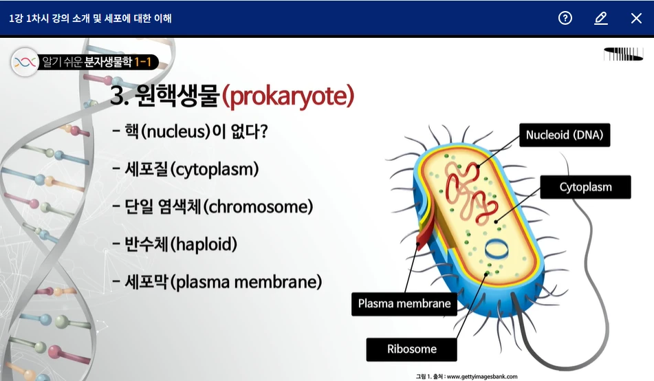
_원핵생물 
https://www.kmooc.kr/view/course/detail/7288?tm=20240608201634
  

* 세균(bacteria) 염색법은 세포벽(cell wall)을 염색하는 방식으로 이루어집니다. 염색이 잘되는 그람 양성균과 잘되지 않는 그람 음성균으로 구분합니다.
  

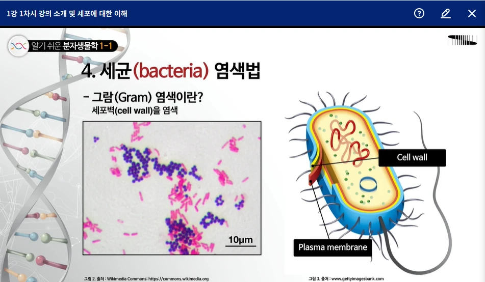
_세균(bacteria) 염색법 
https://www.kmooc.kr/view/course/detail/7288?tm=20240608201634
  

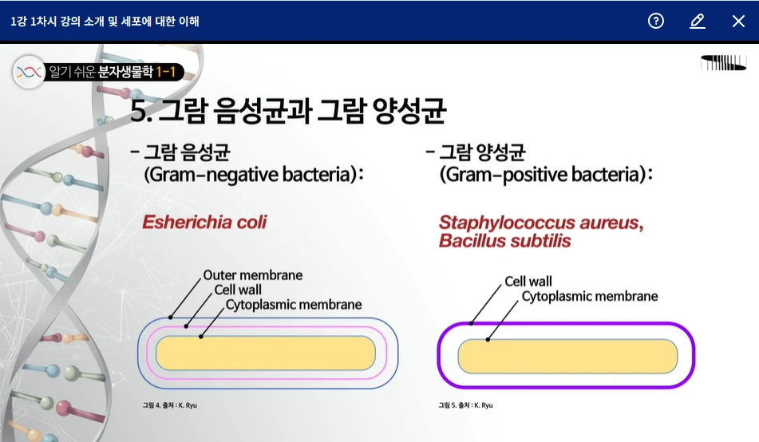
_그람 양성균 vs. 그람 음성균 
https://www.kmooc.kr/view/course/detail/7288?tm=20240608201634
  

## 진핵생물 (eukaryote)
***

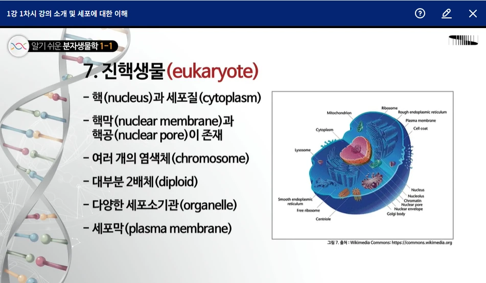
_진핵생물 
https://www.kmooc.kr/view/course/detail/7288?tm=20240608201634
  

* 원색생물과 달리 염색체가 선형(linear)입니다.

* 가장 단순한 구조의 진핵생물은 단세포 진핵생물인 효모(yeast) 입니다.
  

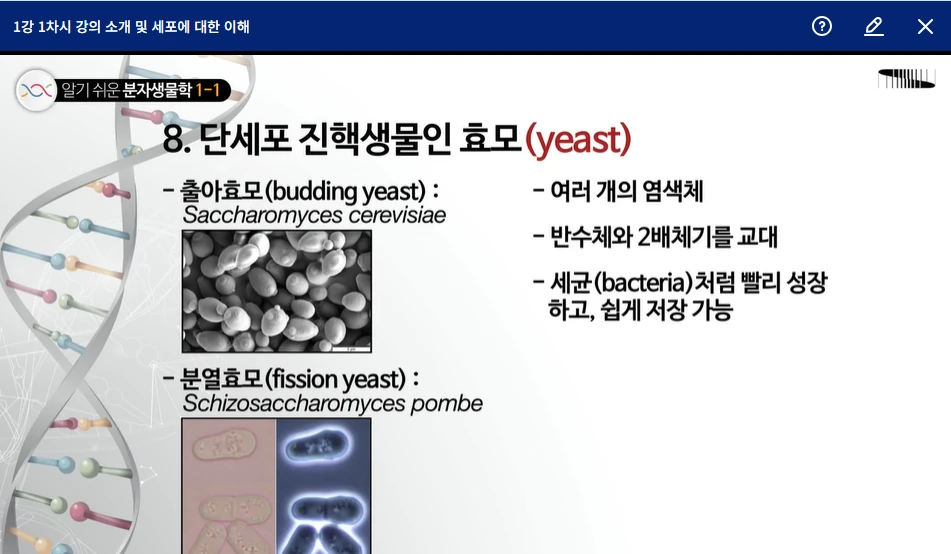
_효모(yeast) 
https://www.kmooc.kr/view/course/detail/7288?tm=20240608201634
  

* 다세포 동물 모델(animal model)로는 생쥐(Mus musculus), 사람 세포(HeLa cells) 등이 있습니다.
  

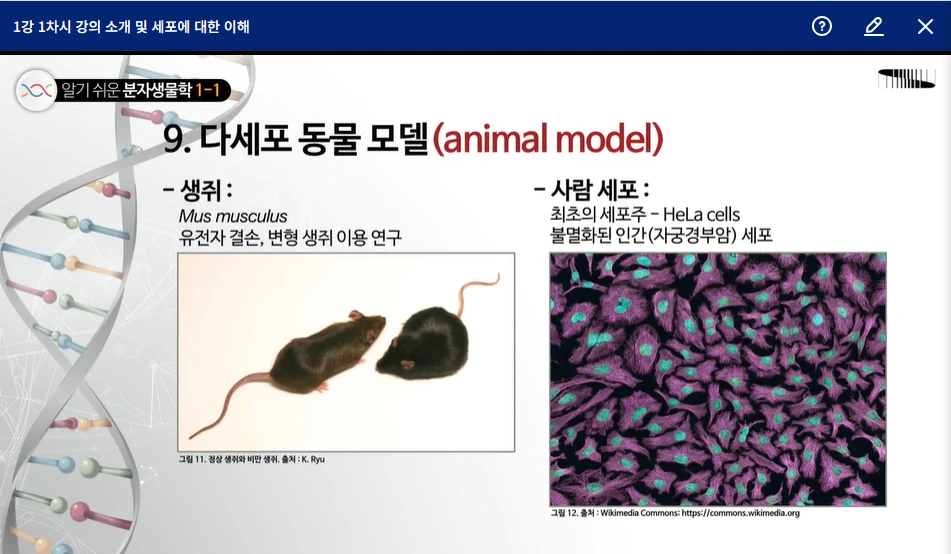
_다세포 동물 모델 
https://www.kmooc.kr/view/course/detail/7288?tm=20240608201634
  

## 유전학 기초
***

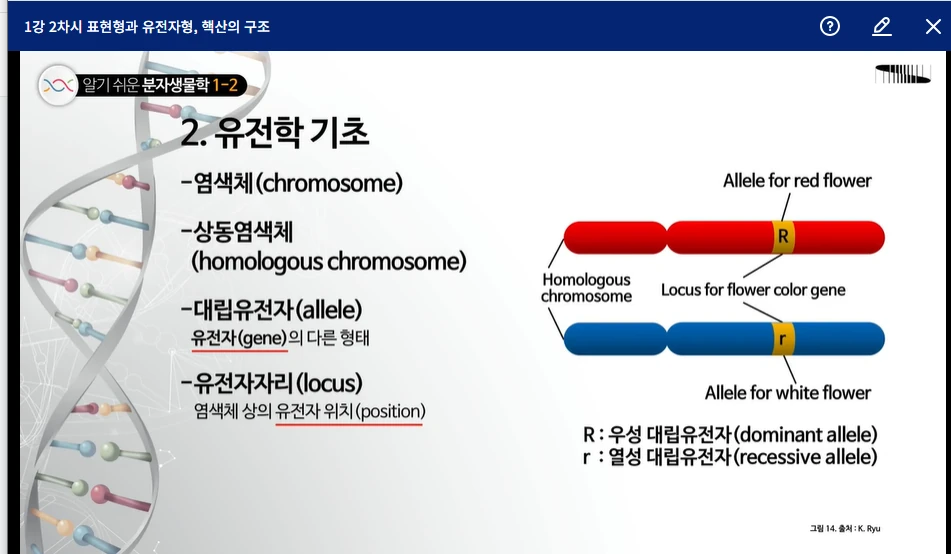
_유전학 기초1 
https://www.kmooc.kr/view/course/detail/7288?tm=20240608201634
  

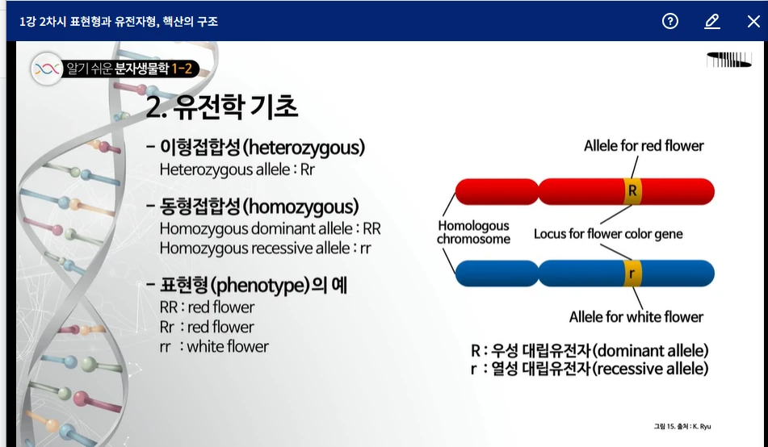
_유전학 기초2 
https://www.kmooc.kr/view/course/detail/7288?tm=20240608201634
  

## 핵산의 화학적 구조
***

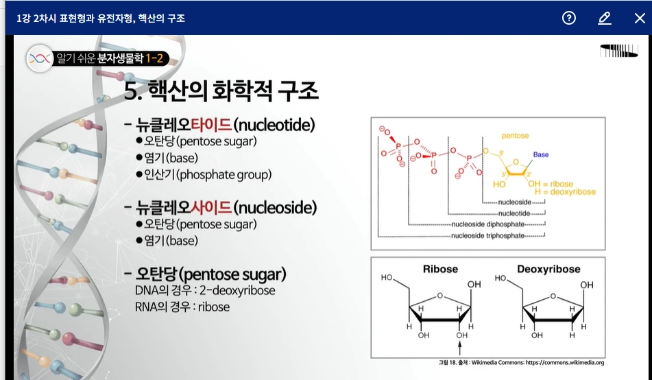
_핵산의 화학적 구조 
https://www.kmooc.kr/view/course/detail/7288?tm=20240608201634
  

* 뉴클레오타이드는 인산이에스테르 결합으로 연결되어 있습니다. 5'-phosphate group(-P)과 3'-hydroxyl group(-OH)의 결합입니다.
  

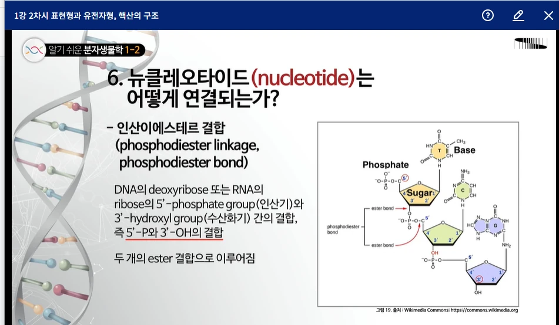
_뉴클레오타이드 인산이에스테르 결합 
https://www.kmooc.kr/view/course/detail/7288?tm=20240608201634
  

## DNA 이중나선 구조
***

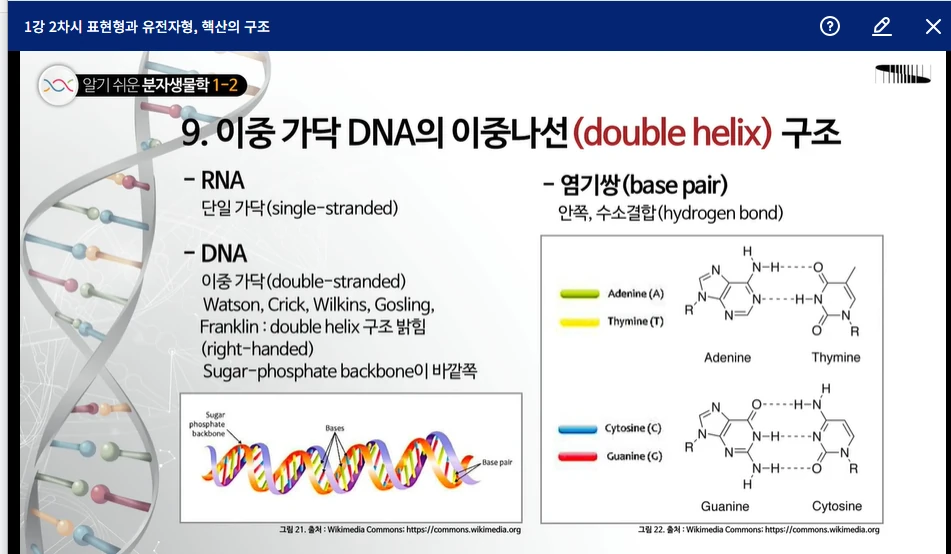
_DNA 이중나선 구조1 
https://www.kmooc.kr/view/course/detail/7288?tm=20240608201634
  

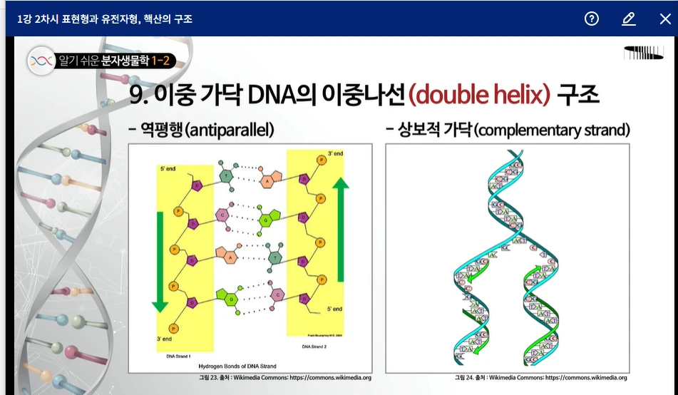
_DNA 이중나선 구조2 
https://www.kmooc.kr/view/course/detail/7288?tm=20240608201634
  

## 중심원리(Central Dogma)
***

* 중심원리(Central Dogma)는 DNA → RNA → Protein으로 전달되는 세포 내 유전정보의 흐름입니다.
  

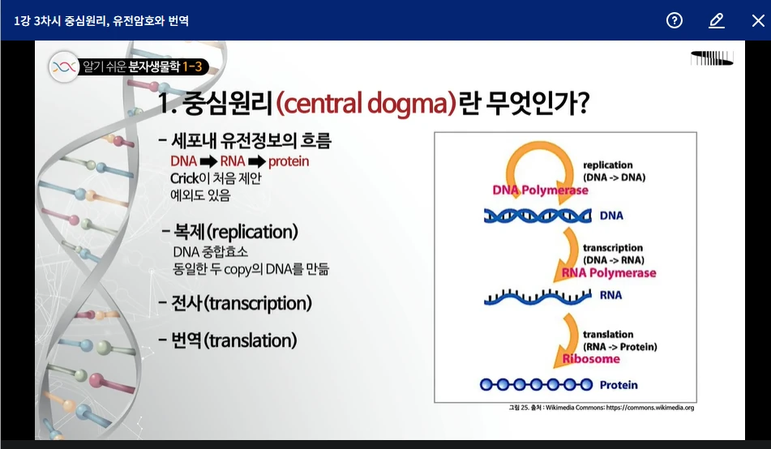
_Central Dogma 
https://www.kmooc.kr/view/course/detail/7288?tm=20240608201634
  

* 전사(transcription)는 DNA → RNA로 유전정보를 전달하는 과정입니다.
  

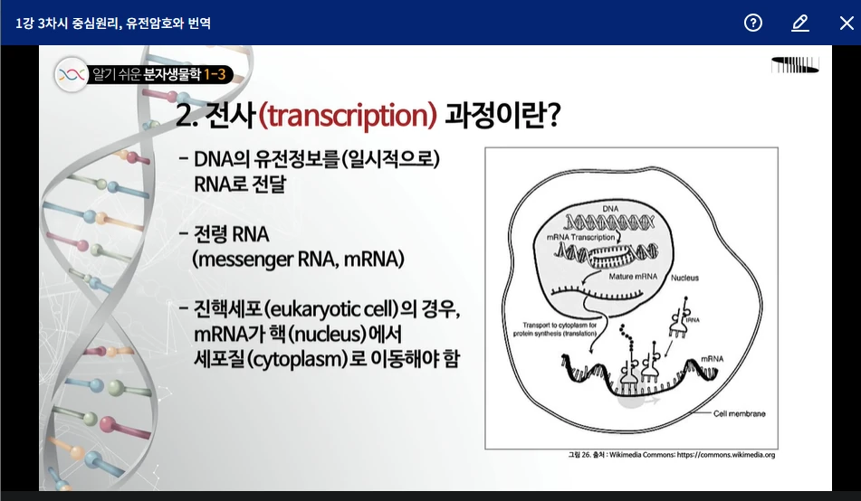
_전사(Transcription) 
https://www.kmooc.kr/view/course/detail/7288?tm=20240608201634
  

* 번역(translation)은 mRNA → Protein을 합성하는 과정입니다.

* 이 때 단백질 합성 기구인 리보솜(ribosome)이 사용됩니다.
  

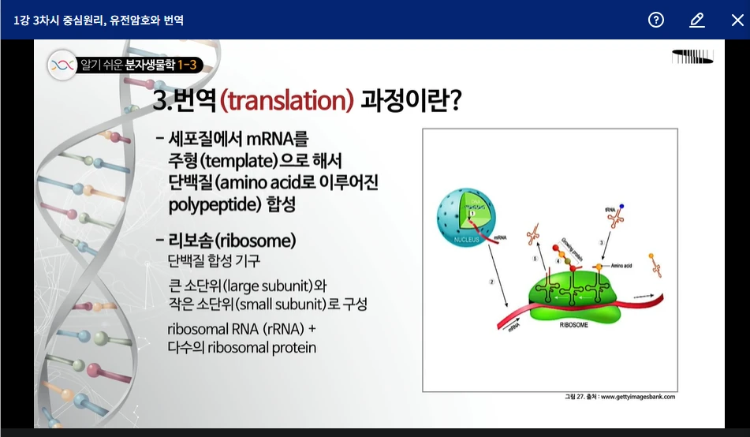
_번역(Translation) 
https://www.kmooc.kr/view/course/detail/7288?tm=20240608201634
  

## 리보솜(ribosome) 구성 요소
***

* 리보솜(ribosome)의 S값은 원심분리 했을 때 침강 속도를 의미합니다. 즉, S값이 클수록 원심분리시 침강 속도가 빠름을 의미합니다.
  

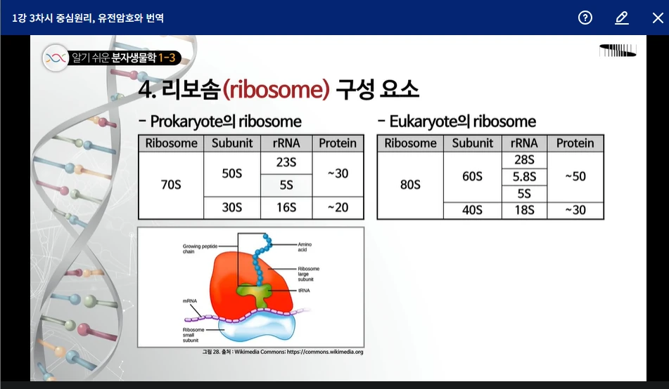
_리보솜(ribosome) 구성 요소 
https://www.kmooc.kr/view/course/detail/7288?tm=20240608201634
  

## 유전암호(genetic code)와 아미노산
***

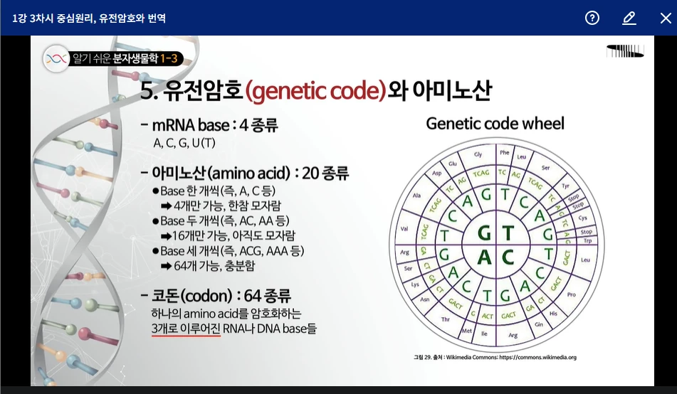
_유전암호(genetic code)와 아미노산 
https://www.kmooc.kr/view/course/detail/7288?tm=20240608201634
  

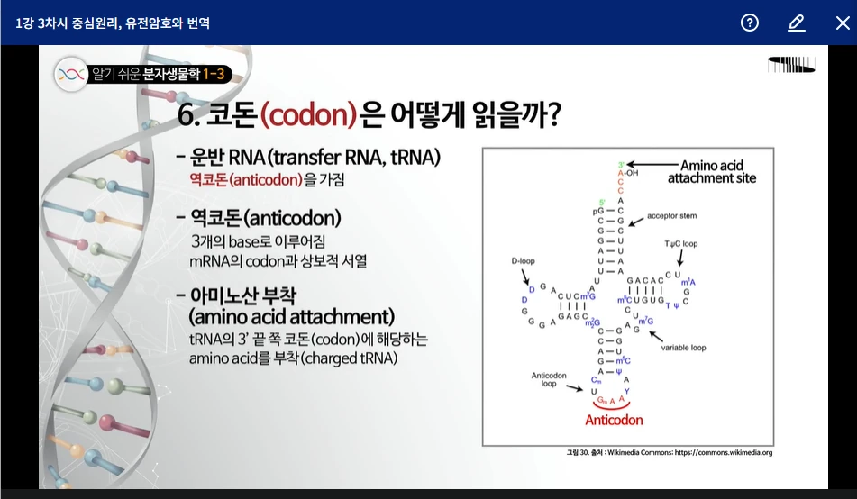
_코돈(codon) 읽기 
https://www.kmooc.kr/view/course/detail/7288?tm=20240608201634
  

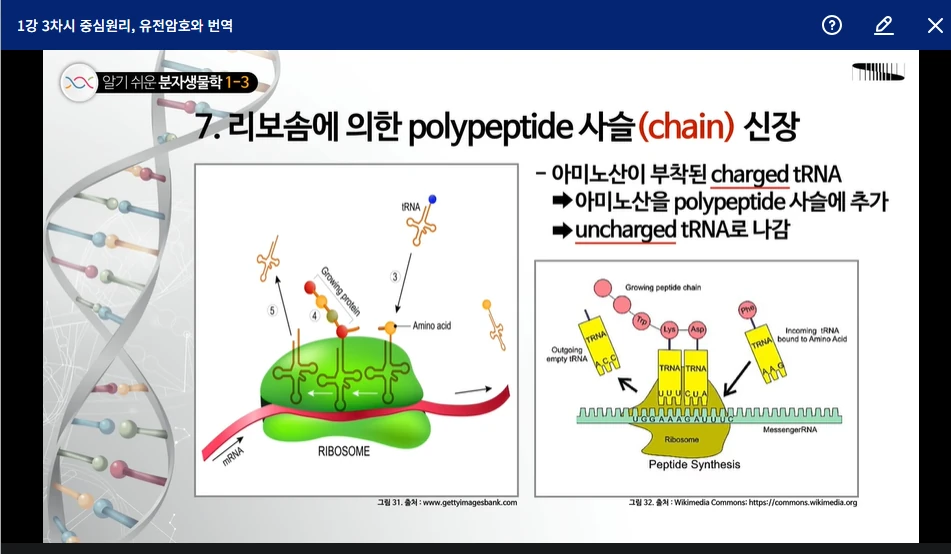
_리보솜 peptide 사슬 신장 
https://www.kmooc.kr/view/course/detail/7288?tm=20240608201634
  

## 아미노산(amino acid)의 기본 구조
***

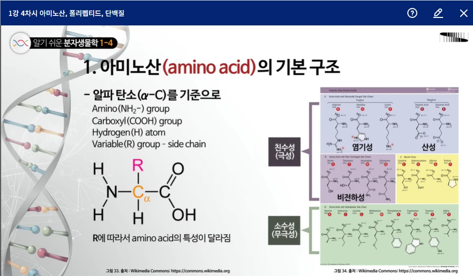
_아미노산의 기본 구조 
https://www.kmooc.kr/view/course/detail/7288?tm=20240608201634
  

* 아미노산 간의 연결은 펩타이드 결합으로 이루어져 있습니다.
  

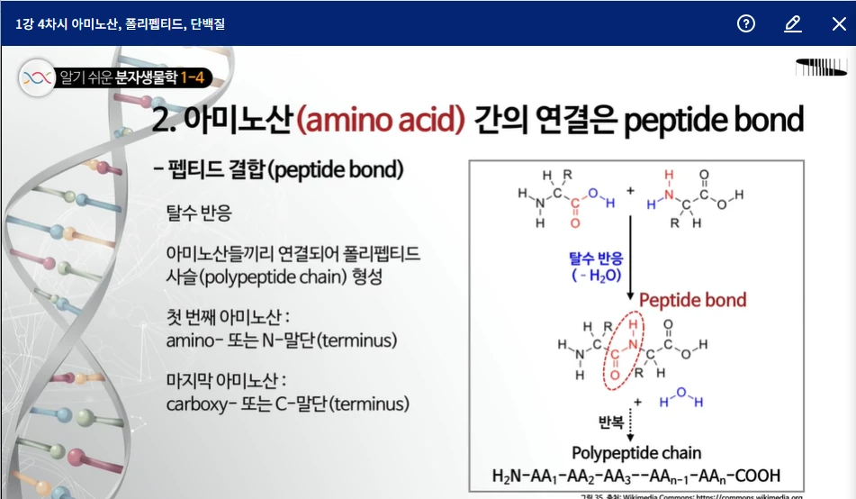
_아미노산 펩타이드 결합 
https://www.kmooc.kr/view/course/detail/7288?tm=20240608201634
  

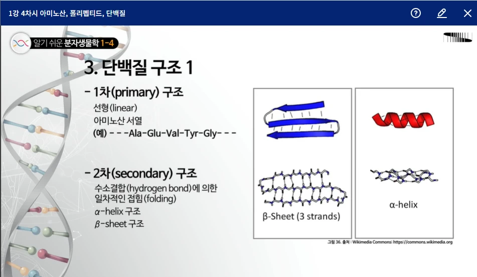
_단백질 1차, 2차 구조 
https://www.kmooc.kr/view/course/detail/7288?tm=20240608201634
  

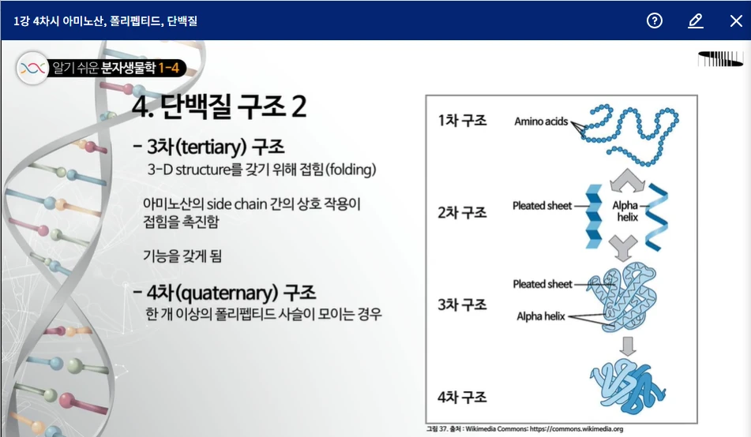
_단백질 3차, 4차 구조 
https://www.kmooc.kr/view/course/detail/7288?tm=20240608201634
  

* 단백질이 이처럼 복잡한 구조를 가지는 이유 중 하나는, 단백질이 접힘에 따라 에너지가 안정화 되기 때문입니다.
  

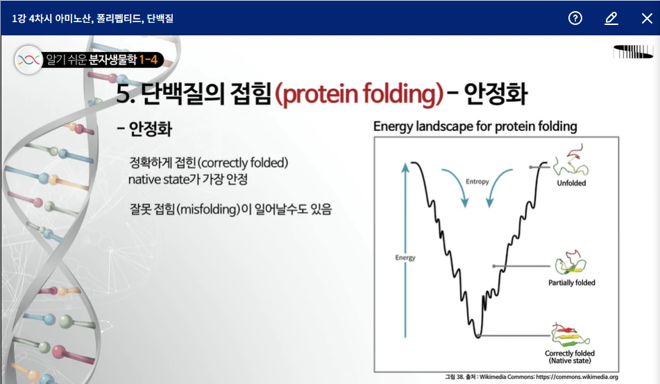
_단백질 접힘과 안정화 
https://www.kmooc.kr/view/course/detail/7288?tm=20240608201634
  

* 또다른 이유는 단백질이 접힘에 따라 활성부위(active site)가 형성되고 특정 기능을 발휘하기 때문입니다.
  

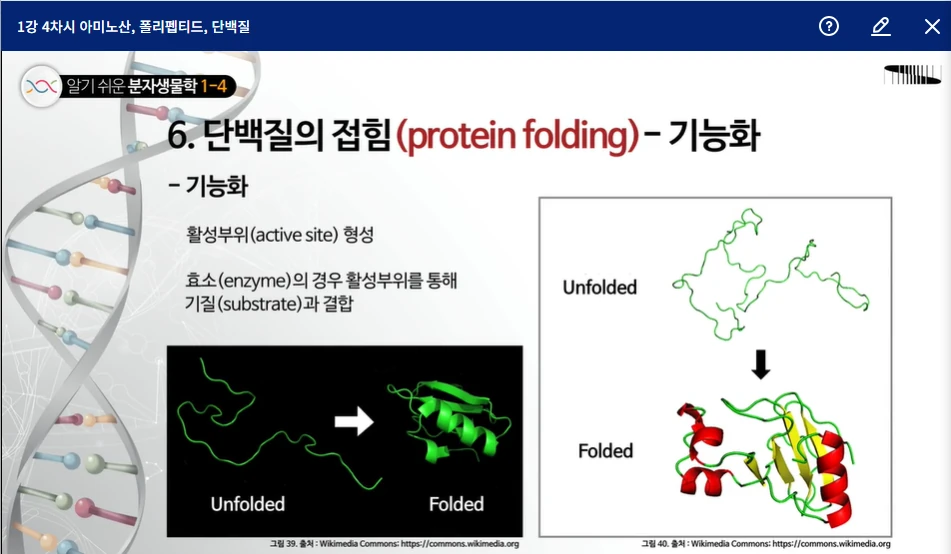
_단백질 접힘과 기능화 
https://www.kmooc.kr/view/course/detail/7288?tm=20240608201634
  
