## 유전체 (genome)
***

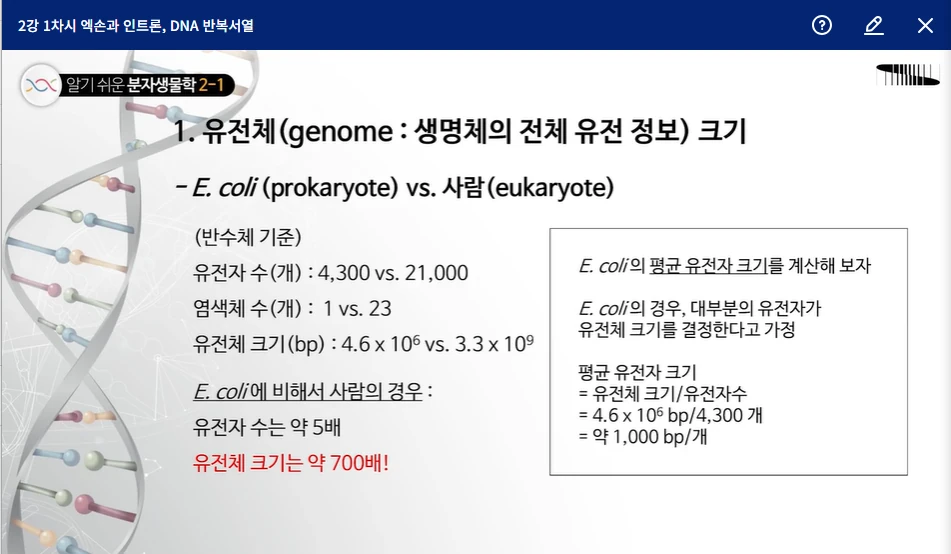
_유전체 크기 
https://www.kmooc.kr/view/course/detail/7288?tm=20240608201634
  

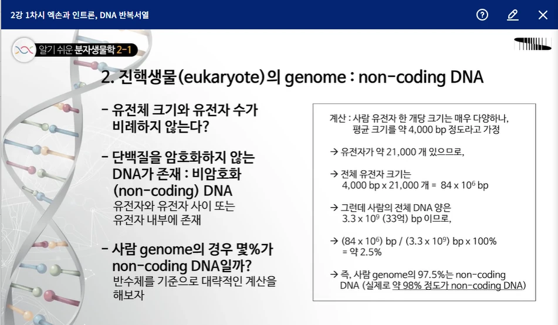
_진핵생물 genome 
https://www.kmooc.kr/view/course/detail/7288?tm=20240608201634
  

* 사람 genome의 97.5%는 non-coding DNA입니다.
  

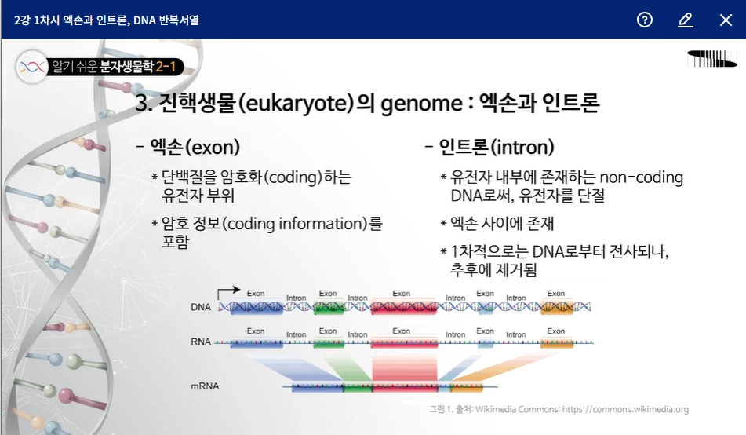
_진핵생물 genome - exon, intron 
https://www.kmooc.kr/view/course/detail/7288?tm=20240608201634
  

* 사람 genome의 약 50%는 반복서열(repetitive sequence)입니다.
  

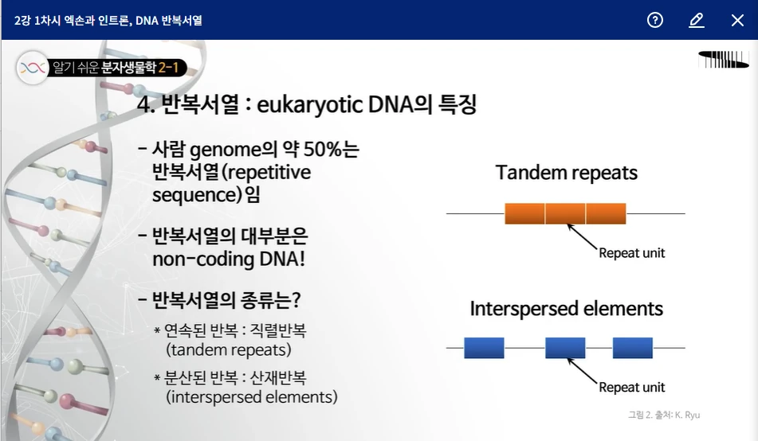
_진핵생물 genome - 반복서열 
https://www.kmooc.kr/view/course/detail/7288?tm=20240608201634
  

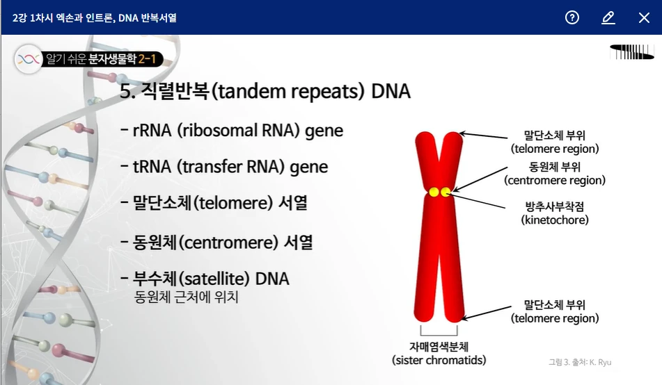
_진핵생물 genome - 직렬반복 DNA1 
https://www.kmooc.kr/view/course/detail/7288?tm=20240608201634
  

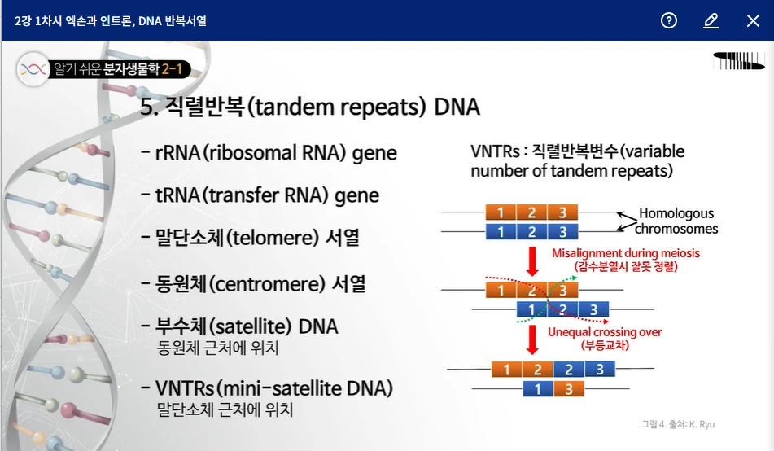
_진핵생물 genome - 직렬반복 DNA2 
https://www.kmooc.kr/view/course/detail/7288?tm=20240608201634
  

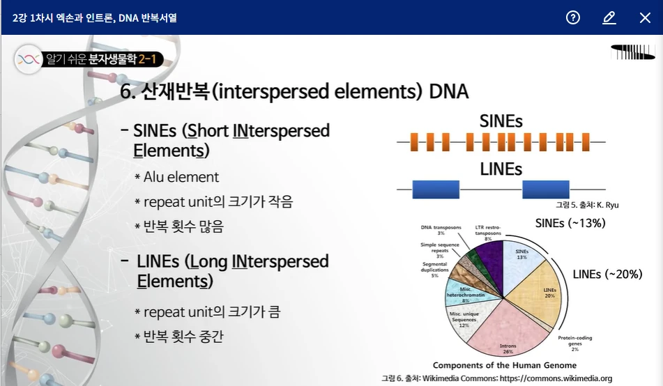
_진핵생물 genome - 산재반복 
https://www.kmooc.kr/view/course/detail/7288?tm=20240608201634
  

## DNA 및 진핵세포 염색질 구조
***

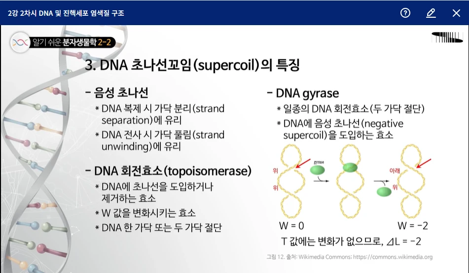
_DNA 초나선꼬임(supercoil) 
https://www.kmooc.kr/view/course/detail/7288?tm=20240608201634
  

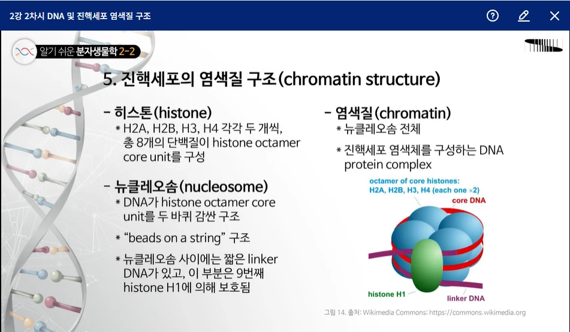
_진핵세초 염색질(chromatin) 구조 
https://www.kmooc.kr/view/course/detail/7288?tm=20240608201634
  

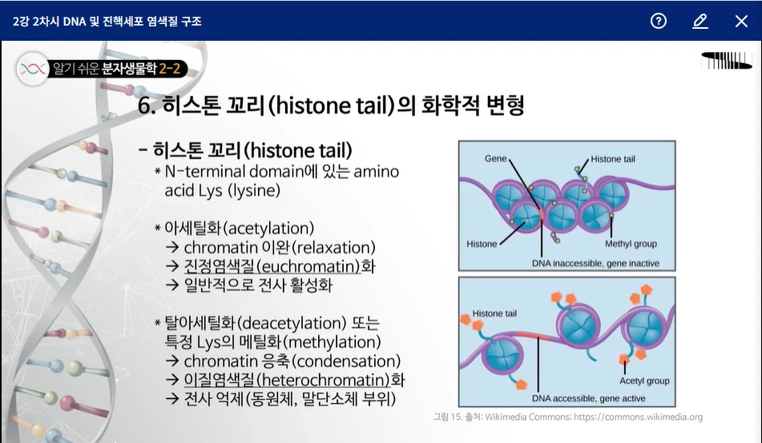
_히스톤 꼬리의 화학적 변형 
https://www.kmooc.kr/view/course/detail/7288?tm=20240608201634
  

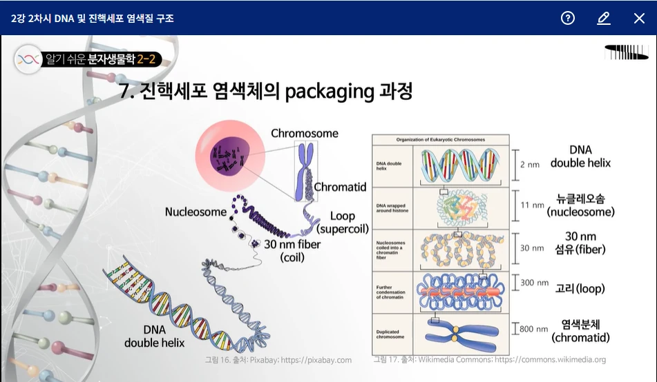
_진핵세포 염색체의 packaging 과정 
https://www.kmooc.kr/view/course/detail/7288?tm=20240608201634
  

## 핵산 조작 기술
***

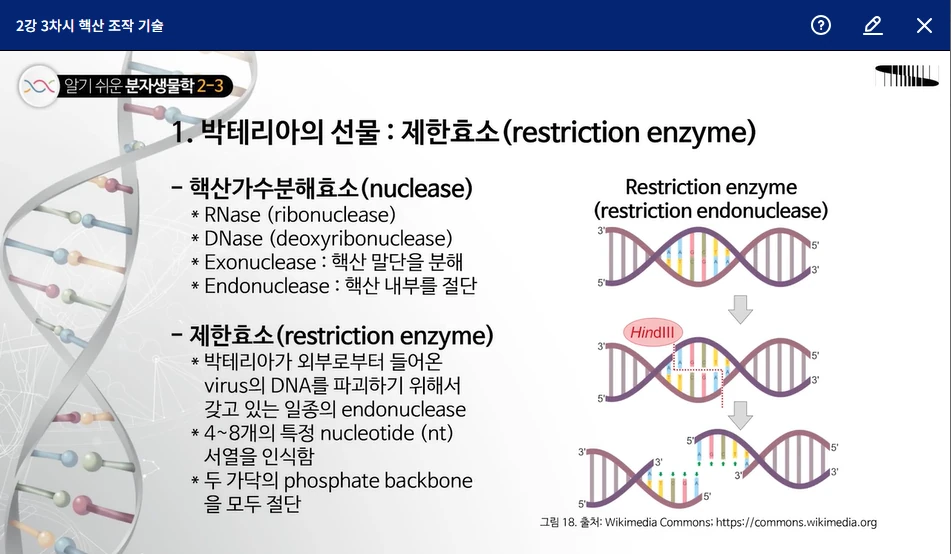
_박테리아 제한효소(resriction enzyme) 
https://www.kmooc.kr/view/course/detail/7288?tm=20240608201634
  

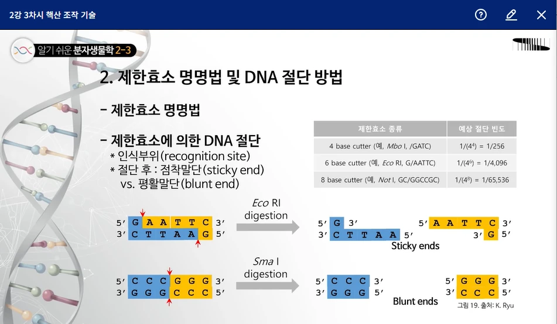
_제한효소(resriction enzyme) 명명법, 절단 방법 
https://www.kmooc.kr/view/course/detail/7288?tm=20240608201634
  

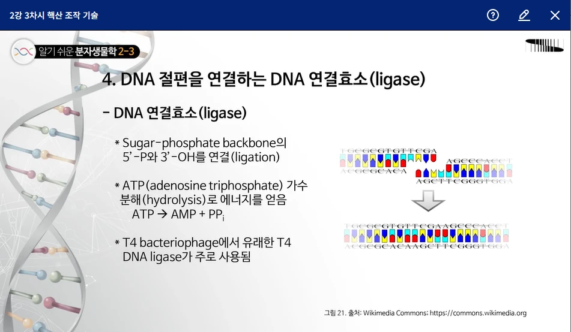
_DNA 연결효소(ligase) 
https://www.kmooc.kr/view/course/detail/7288?tm=20240608201634
  

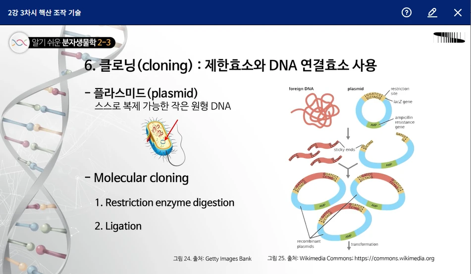
_클로닝(cloning) 
https://www.kmooc.kr/view/course/detail/7288?tm=20240608201634
  

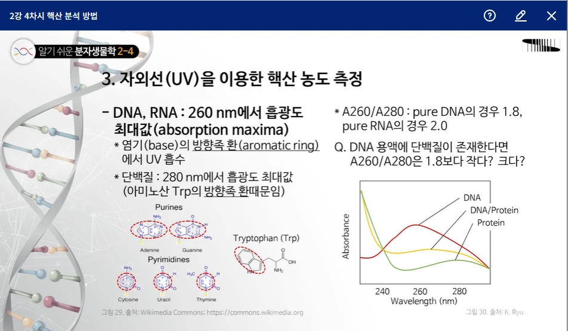
_자외선(UV)을 이용한 핵산 농도 측정 
https://www.kmooc.kr/view/course/detail/7288?tm=20240608201634
  
