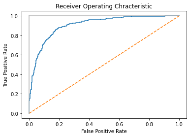
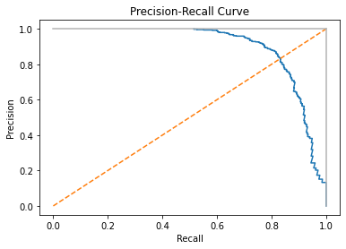
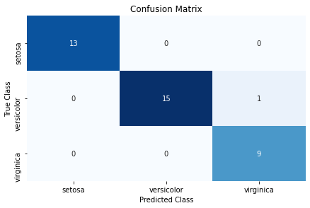
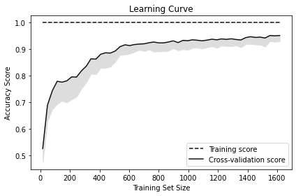
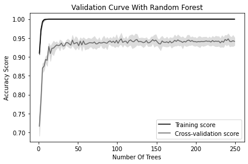

## Summary
***

 Model은 예측성능이 높아야 유용합니다. 근본적인 목적은 고품질의 model을 만드는 것입니다. Algorithm이 만드는 model의 평가 방법을 알아봅니다.
 <br /><br />


 * 교차검증 model 만들기 (11.1)

```python
# Model을 훈련하고 어떤 성능지표(정확도, 제곱오차 등)를 사용하여 얼마나 잘 동작하는지 계산합니다.

# Training set에 한정해서 잘 동작하는 model이 아니라 새로운 data에 대해서 잘 동작하길 기대합니다.

# KFCV(K-Fold Cross-Validation)를 사용하여 최종 성능을 산출합니다.
```
<br /><br />


 * 기본 regreesion model 만들기 (11.2)

```python
# Regression model 평가는 결정계수(R^2)를 사용합니다.
$ R^2 = 1 - \\frac{\\sum_{i} (y_{i}-\\hat{y}_{i})^2}{\\sum_{i} (y_{i}-\\bar{y}_{i})^2} $
```
<br /><br />


 * 기본 classification model 만들기 (11.3)

```python
# Classification model의 성능을 측적하는 일반적인 방법은 random 추측보다 얼마나 더 나은지 비교하는 것입니다.
```
<br /><br />


 * 이진 분류기의 예측 평가하기 (11.4)

```python
# sklearn의 cross_val_score 함수 사용: 훈련된 classification model의 품질을 평가합니다. 교차검증을 수행할 때 scoring 매개변수에 성능지표 중 하나를 선택합니다.

# Accuracy(정확도), Precision(정밀도), Recall(재현률), F-1이 있습니다.
```
<br /><br />


## Practice
***

### 11.0 소개   
   
이 장에서 학습 알고리즘으로 만든 모델의 성능을 평가하기 위한 전략을 살펴보겠습니다.   
모델 만드는 방법을 설명하기 전 평가에 대해 소개하는 이유는 여러 가지가 있습니다.   
모델은 예측 성능이 높아야 유용하므로, 우리의 근본적인 목적은 그냥 모델을 만드는 것이 아니라 고품질의 모델을 만드는 것입니다.   
따라서 다양한 학습 알고리즘을 탐험하기 전에 먼저 알고리즘이 만들 모델의 평가 방법에 대해 알아야 합니다.

### 11.1 교차검증 모델 만들기   
   
실전에서 모델이 얼마나 잘 작동할지 평가하고 싶습니다.   
데이터 전처리 파이프라인을 만들고 모델을 훈련한 다음 교차검증으로 평가합니다.

```python
from sklearn import datasets
from sklearn import metrics
from sklearn.model_selection import KFold, cross_val_score
from sklearn.pipeline import make_pipeline
from sklearn.linear_model import LogisticRegression
from sklearn.preprocessing import StandardScaler

# 숫자 데이터셋을 로드합니다.
digits = datasets.load_digits()

# 특성 행렬을 만듭니다.
features = digits.data

# 타겟 벡터를 만듭니다.
target = digits.target

# 표준화 객체를 만듭니다.
standardizer = StandardScaler()

# 로지스틱 회귀 객체를 만듭니다.
logit = LogisticRegression()

# 표준화한 다음 로지스틱 회귀를 실행하는 파이프라인을 만듭니다.
pipeline = make_pipeline(standardizer, logit)

# k-폴드 교차검증을 만듭니다.
kf = KFold(n_splits=10, shuffle=True, random_state=1)

# k-폴드 교차검증을 수행합니다.
cv_results = cross_val_score(pipeline, # 파이프라인
                            features, # 특성 행렬
                            target, # 타겟 벡터
                            cv=kf, # 교차검증 기법
                            scoring="accuracy", # 평가 지표
                            n_jobs=-1) # 모든 CPU 코어 사용

# 평균을 계산합니다.
cv_results.mean()
```

```text
0.9693916821849783
```

처음에는 지도 학습 모델을 평가하는 것이 간단해 보입니다.   
모델을 훈련하고 어떤 성능 지표(정확도, 제곱 오차 등)를 사용하여 얼마나 잘 동작하는지 계산합니다.   
그러나 이런 방식은 근본적으로 문제가 있습니다. 모델을 훈련한 데이터로 모델이 얼마나 잘 수행되는지 평가한다면 원하는 목표를 달성하지 못합니다. 우리의 목표는 훈련 데이터에서 잘 동작하는 모델이 아니라 이전에 본 적 없는 데이터(예를 들어, 새로운 고객, 새로운 범죄, 새로운 이미지)에서 잘 동작하는 모델입니다. 이런 이유로 평가 방법은 이전에 본 적 없는 데이터에서 모델이 얼마나 좋은 예측을 만드는지 알 수 있어야 합니다.   
   
한 가지 방법은 데이터의 일부를 테스트용으로 떼어놓는 것입니다. 이를 검증<sup>validation</sup> (또는 홀드아웃<sup>hold-out</sup>)이라고 부릅니다.   
검증에서 샘플(특성과 타겟)은 두 개의 세트로 나뉩니다. 전통적으로 이를 훈련 세트<sup>training set</sup>와 테스트 세트<sup>test set</sup>라고 부릅니다.   
그다음 훈련 세트의 특성과 타겟 벡터를 사용해 최선의 예측을 만드는 방법을 모델 훈련을 통해 가르칩니다.   
마지막으로 훈련 세트에서 훈련한 모델을 이전에 본 적 없는 외부 데이터처럼 가장한 테스트 세트에서 얼마나 잘 동작하는지 평가합니다. 그러나 이 검증 방법은 두 가지 약점이 있습니다.   
1. 모델 성능은 테스트 세트로 나뉜 일부 샘플에 의해 결정됩니다.
2. 전체 가용 데이터를 사용하여 모델을 훈련하고 테스트하지 못합니다.   
   
k-폴드 교차검증<sup>k-fold cross-validation, KFCV</sup>은 이런 단점을 극복할 수 있는 좋은 방법입니다.   
KFCV에서는 데이터를 폴드<sup>fold</sup>라고 부르는 k개의 부분으로 나눕니다. k-1개 폴드를 하나의 훈련 세트로 합쳐 모델을 훈련하고 남은 폴드를 테스트 세트처럼 사용합니다. 이를 k번 반복합니다. 반복마다 다른 폴드를 테스트 세트로 사용합니다. k번 반복에서 얻은 모델 성능을 평균하여 최종 성능을 산출합니다.   
   
해결에서 10개의 폴드를 사용하여 k-폴드 교차검증을 수행했습니다. 평가 점수는 cv_results에 저장되어 있습니다.

```python
# 10개 폴드의 점수를 모두 확인하기
cv_results
```

```text
array([0.97777778, 0.98888889, 0.96111111, 0.94444444, 0.97777778,
       0.98333333, 0.95555556, 0.98882682, 0.97765363, 0.93854749])
```

KFCV를 사용할 때 고려해야 할 중요한 점이 세 가지 있습니다.   
1. KFCV는 각 샘플이 다른 샘플과 독립적으로 생성되었다고 가정합니다 (즉 데이터는 독립 동일 분포<sup>independent identically distributed, IID</sup>). 데이터가 IID라면 폴드를 나누기 전에 샘플을 섞는 것이 좋은 생각입니다. sklearn에서는 shuffle=True로 지정하면 섞을 수 있습니다.
2. KFCV를 사용하는 분류기<sup>classifier</sup>를 평가할 때, 각 타겟 클래스의 샘플이 거의 같은 비율로 폴드에 담기는 것이 좋습니다 (계층별 k-폴드<sup>stratified k-fold</sup>라고 부릅니다). 예를 들어 성별 타겟 벡터 중에서 80% 샘플이 남성이라면 각 폴드도 80% 남성과 20% 여성 샘플로 이루어져야 합니다. sklearn에서는 KFold 클래스를 StratifiedKFold로 바꾸어 계층별 k-폴드 교차검증을 수행할 수 있습니다.
3. 검증 세트나 교차검증을 사용할 때 훈련 세트에서 데이터를 전처리하고 이 변환을 훈련 세트와 테스트 세트에 모두 적용하는 것이 중요합니다. 예를 들면 표준화 객체 standardizer의 fit 메서드를 호출하여 훈련 세트의 평균과 분산을 계산합니다. 그다음 이 변환을 (transform 메서드를 사용해) 훈련 세트와 테스트 세트에 모두 적용합니다.

```python
from sklearn.model_selection import train_test_split

# 훈련 세트와 테스트 세트를 만듭니다.
features_train, features_test, target_train, target_test = train_test_split(features, target, test_size=0.1, random_state=1)

# 훈련 세트로 standardizer의 fit 메서드를 호출합니다.
standardizer.fit(features_train)

# 훈련 세트와 테스트 세트에 모두 적용합니다.
features_train_std = standardizer.transform(features_train)
features_test_std = standardizer.transform(features_test)
```

sklearn의 pipeline 패키지는 교차검증 기법을 사용할 때 이 규칙을 손쉽게 구현할 수 있도록 도와줍니다. 먼저 데이터를 전처리 (예를 들면 standardizer)하고 모델(로지스틱 회귀인 logit)을 훈련하는 파이프라인을 만듭니다.

```python
# 파이프라인을 만듭니다.
pipeline = make_pipeline(standardizer, logit)
```

그다음 이 파이프라인으로 KFCV를 실행하면 sklearn이 모든 작업을 알아서 처리합니다.

```python
# k-폴드 교차검증 수행
cv_results = cross_val_score(pipeline, #파이프라인
                             features, # 특성 행렬
                             target, # 타겟 벡터
                             cv=kf,  #교차 검증
                             scoring="accuracy", # 평가 지표
                             n_jobs=-1) # 모든 CPU 코어 사용

cv_results
```

```text
array([0.97777778, 0.98888889, 0.96111111, 0.94444444, 0.97777778,
       0.98333333, 0.95555556, 0.98882682, 0.97765363, 0.93854749])
```

cross_val_score에는 아직 이야기하지 않은 중요한 세 개의 매개변수가 있습니다.   
cv는 교차검증 기법을 결정합니다. k-폴드를 가장 많이 사용하지만 다른 방식도 있습니다. LOOCV<sup>leave-one-out-cross-validation</sup>는 폴드의 수 k가 샘플의 개수와 같습니다.   
scoring 매개변수는 이 장의 다른 여러 레시피에서 설명할 모델 성공의 측정 방법을 결정합니다.   
n_jobs=-1은 sklearn에게 가용한 모든 코어를 사용하도록 지시합니다.

### 11.2 기본 회귀 모델 만들기   
   
sklearn의 DummyRegressor를 사용하여 기본 모델로 사용할 간단한 더미 모델을 만듭니다.

```python
from sklearn.datasets import load_boston
from sklearn.dummy import DummyRegressor
from sklearn.model_selection import train_test_split

# 데이터를 로드합니다.
boston = load_boston()

# 특성을 만듭니다.
features, target = boston.data, boston.target

# 훈련 세트와 테스트 세트를 나눕니다.
features_train, features_test, target_train, target_test = train_test_split(features, target, random_state=0)

# 더미 회귀 모델을 만듭니다.
dummy = DummyRegressor(strategy='mean')

# 더미 회귀 모델을 훈련합니다.
dummy.fit(features_train, target_train)

# R^2 점수를 계산합니다.
dummy.score(features_test, target_test)
```

```text
-0.001119359203955339
```

다른 모델을 훈련하고 평가하여 성능 점수를 비교합니다.

```python
from sklearn.linear_model import LinearRegression

# 간단한 선형 회귀 모델을 훈련합니다.
ols = LinearRegression()
ols.fit(features_train, target_train)

# R^2 점수를 계산합니다.
ols.score(features_test, target_test)
```

```text
0.6354638433202128
```

기본적으로 score 메서드는 결정계수<sup>coefficient of determination, R^2</sup> 값을 반환합니다.   
>$
R^2 = 1 - \frac{\sum_{i} (y_{i}-\hat{y}_{i})^2}{\sum_{i} (y_{i}-\bar{y}_{i})^2}
$   
여기에서 $ y_{i} $는 샘플의 정답 타겟입니다. $ \hat{y}_{i} $은 예측한 값이고 $ \bar{y} $은 타겟 벡터의 평균값입니다.
$ R^2 $이 1에 가까울수록 특성이 타겟 벡터의 분산을 잘 설명합니다.

### 11.3 기본 분류 모델 만들기   
   
sklearn의 DummyClassifier를 사용합니다.

```python
from sklearn.datasets import load_iris
from sklearn.dummy import DummyClassifier
from sklearn.model_selection import train_test_split

# 데이터를 로드합니다.
iris = load_iris()

# 타겟 벡터와 특성 행렬을 만듭니다.
features, target = iris.data, iris.target

# 훈련 세트와 테스트 세트로 나눕니다.
features_train, features_test, target_train, target_test = train_test_split(features, target, random_state=0)

# 더미 분류 모델을 만듭니다.
dummy = DummyClassifier(strategy='uniform', random_state=1)

# 모델을 훈련합니다.
dummy.fit(features_train, target_train)

# 정확도 점수를 계산합니다.
dummy.score(features_test, target_test)
```

```text
0.42105263157894735
```

훈련 다른 모델과 기본 모델을 비교하여 더 나은지 확인할 수 있습니다.

```python
from sklearn.ensemble import RandomForestClassifier

# 분류 모델을 만듭니다.
classifier = RandomForestClassifier()

# 모델을 훈련합니다.
classifier.fit(features_train, target_train)

# 정확도 점수를 계산합니다.
classifier.score(features_test, target_test)
```

```text
0.9736842105263158
```

분류 모델의 성능을 측정하는 일반적인 방법은 랜덤한 추측보다 얼마나 더 나은지 비교하는 것입니다.   
sklearn의 DummyClassifier를 사용하면 이런 비교를 쉽게할 수 있습니다.   
strategy 매개변수는 예측값을 생성하는 여러 가지 옵션을 제공합니다. 전형적으로 많이 사용하는 두 가지 전략이 있습니다.
1. stratified 옵션은 훈련 세트에 있는 타겟 벡터의 클래스 비율에 비례하는 예측을 만듭니다.
2. uniform 옵션은 클래스 비중이 균등하도록 랜덤하게 예측합니다.

strategy에 자주 사용하는 또 다른 옵션은 most_frequent입니다. 이 옵션은 무조건 훈련 세트에서 가장 많은 타겟 레이블로 예측을 만듭니다.

```python
dummy = DummyClassifier(strategy='most_frequent')
dummy.fit(features_train, target_train)

# 훈련 세트 타겟에서 가장 많은 값으로 예측합니다.
dummy.predict(features_test)
```

```text
array([2, 2, 2, 2, 2, 2, 2, 2, 2, 2, 2, 2, 2, 2, 2, 2, 2, 2, 2, 2, 2, 2,
       2, 2, 2, 2, 2, 2, 2, 2, 2, 2, 2, 2, 2, 2, 2, 2])
```

훈련 세트에 있는 타겟값을 확인해보면 클래스 레이블 2가 가장 많습니다.

```python
import numpy as np

# 훈련 세트의 타겟 개수를 확인합니다.
np.bincount(target_train)
```

```text
array([37, 34, 41], dtype=int64)
```

### 11.4 이진 분류기의 예측 평가하기   
   
훈련된 분류 모델의 품질을 평가합니다.   
sklearn의 cross_val_score 함수를 사용하여 교차검증을 수행할 때 scoring 매개변수에 성능 지표 중 하나를 선택할 수 있습니다.   
정확도, 정밀도<sup>precision</sup>, 재현율<sup>recall</sup>, F-1 이 있습니다.   
   
정확도는 널리 사용되는 성능 지표입니다. 단순히 올바르게 예측된 샘플의 비율입니다.
>$
Accuracy = \frac{TP + TN}{TP + TN + FP + FN}
$   
* TP: 진짜 양성 개수입니다. 양성 클래스 중에서 올바르게 예측한 샘플 개수입니다.
* TN: 진짜 음성 개수입니다. 음성 클래스 중에서 올바르게 예측한 샘플 계수입니다.
* FP: 거짓 양성 개수입니다. type I error라고도 부릅니다. 양성 클래스로 예측한 것 중에서 실제 음성 클래스인 샘플 개수입니다.
* FN: 거짓 음성 개수입니다. type II error라고도 부릅니다. 음성 클래스로 예측한 것 중에서 실제 양성 클래스인 샘플 개수입니다.   
   
scoring="accuracy"로 지정하여 기본값은 3-폴드 교차검증의 정확도를 측정할 수 있습니다.

```python
from sklearn.model_selection import cross_val_score
from sklearn.linear_model import LogisticRegression
from sklearn.datasets import make_classification

# 특성 행렬과 타겟 벡터를 만듭니다.
X, y = make_classification(n_samples = 10000,
                           n_features = 3,
                           n_informative = 3,
                           n_redundant = 0,
                           n_classes = 2,
                           random_state = 1)

# 로지스틱 회귀 모델을 만듭니다.
logit = LogisticRegression()

# 정확도를 사용하여 교차검증을 수행합니다.
cross_val_score(logit, X, y, scoring="accuracy")
```

```text
array([0.9555, 0.95  , 0.9585, 0.9555, 0.956 ])
```

정확도는 직관적이고 쉽게 설명할 수 있다는 것이 장점입니다.   
정확도는 단순히 정확히 예측한 샘플의 비율입니다. 그러나 실전에서는 클래스 비율이 불균형한 데이터가 많습니다. (예를 들면 샘플의 99.9%는 클래스 1이고 0.1%만이 클래스 2인 경우) 클래스가 불균형하면 모델의 정확도는 높지만 예측 성능이 나쁜 역설적인 상황이 발생합니다.   
예를 들어 전체 인구의 0.1%에서 발생하는 매우 희귀한 암의 발병을 예측한다고 가정해봅니다. 어떤 모델을 훈련한 후 95%의 정확도를 얻었습니다. 하지만 99.9%의 사람들이 암에 걸리지 않으므로 단순히 아무도 암에 걸리지 않았다고 예측하는 모델을 만들면 4.9%만큼 더 정확한 모델을 만들 수 있습니다. 사실 이 모델은 어떤 것도 예측하지 않습니다. 이런 이유 때문에 정밀도, 재현율, $ F_{1} $점수 같은 다른 지표를 사용하게 됩니다.   
   
정밀도는 양성으로 예측한 샘플 중에서 진짜 양성 클래스의 비율입니다.   
이를 예측에 포함된 잡음이라고 생각할 수 있습니다. 즉 어떤 것을 양성 클래스로 예측했을 때 얼마나 올바른지를 나타냅니다. 높은 정밀도의 모델은 양성 클래스라고 확인이 높을 때만 양성 샘플로 예측합니다. 정밀도 공식은 다음과 같습니다.
>$
정밀도 = \frac{TP}{TP + FP}
$

```python
# 정밀도를 사용한 교차검증
cross_val_score(logit, X, y, scoring="precision")
```

```text
array([0.95963673, 0.94820717, 0.9635996 , 0.96149949, 0.96060606])
```

재현율은 진짜 양성 샘플 중에서 양성으로 예측한 비율입니다.   
재현율은 모델이 양성 클래스 샘플을 구분하는 능력을 측정합니다. 높은 재현율의 모델은 샘플을 양성 클래스로 예측하기 위해서 낮은 기준을 가집니다.   
>$
재현율 = \frac{TP}{TP + FN}
$

```python
# 재현율을 사용한 교차검증
cross_val_score(logit, X, y, scoring="recall")
```

```text
array([0.951, 0.952, 0.953, 0.949, 0.951])
```

정확도와 비교했을 때 정밀도와 재현율은 덜 직관적입니다. 거의 항상 정밀도와 재현율 간의 균형을 맞추어야 합니다. 이를 위해 $ F_{1} $점수가 만들어졌습니다. $ F_{1} $은 정밀도와 재현율의 조화 평균<sup>harmonic mean</sup>입니다 (비율에 대한 평균의 한 종류).
>$
F_{1} = 2 \times \frac{정밀도 x 재현율}{정밀도 + 재현율}
$

이는 진짜 양성 레이블을 가진 샘플을 양성으로 성공적으로 예측한 정도를 측정합니다.

```python
# F1 점수를 사용한 교차검증
cross_val_score(logit, X, y, scoring="f1")
```

```text
array([0.95529884, 0.9500998 , 0.95827049, 0.95520886, 0.95577889])
```

평가 지표로서 정확도는 유용한 성질을 가지고 있습니다. 특히 이해하기 쉽습니다. 하지만 종종 정밀도와 재현율의 균형을 맞추는 것이 더 좋은 지표가 됩니다. 즉 비관적인 모델과 긍정적인 모델 사이의 트레이드오프입니다. $ F_{1} $은 정밀도와 재현율을 비교적 동등하게 취급하여 이 둘 사이의 균형을 표현합니다.   
   
CROSS_VAL_SCORE를 사용하는 대신 진짜 y 값과 예측한 y 값이 있으면 직접 정확도와 재현율을 계산할 수 있습니다.

```python
from sklearn.model_selection import train_test_split
from sklearn.metrics import accuracy_score

# 훈련 세트와 테스트 세트로 나눕니다.
X_train, X_test, y_train, y_test = train_test_split(X, y, test_size=0.1, random_state=1)

# 테스트 세트의 예측을 만듭니다.
y_hat = logit.fit(X_train, y_train).predict(X_test)

# 정확도를 계산합니다.
accuracy_score(y_test, y_hat)
```

```text
0.947
```

cross_val_score 함수의 cv 매개변수를 지정하지 않으면 회귀일 때는 KFold, 분류일 때는 StratifiedKFold 분할기가 사용됩니다. cv 매개변수에 정수를 입력하여 기본 분할기의 폴드 수를 지정할 수도 있습니다.   
   
skleran v0.19에서 cross_validate 함수가 추가되었습니다. 이 함수는 cross_val_score와 사용법이 매우 비슷하지만 scoring 매개변수에 여러 개의 평가 지표를 추가할 수 있습니다.

```python
from sklearn.model_selection import cross_validate

# 정확도와 정밀도를 사용한 교차검증
cross_validate(logit, X, y, scoring=["accuracy", "precision"])
```

```text
{'fit_time': array([0.01211786, 0.01238918, 0.01191044, 0.01131439, 0.01084232]),
 'score_time': array([0.0019803 , 0.00102544, 0.00199318, 0.0010097 , 0.00099707]),
 'test_accuracy': array([0.9555, 0.95  , 0.9585, 0.9555, 0.956 ]),
 'test_precision': array([0.95963673, 0.94820717, 0.9635996 , 0.96149949, 0.96060606])}
```

### 11.5 이진 분류기 임곗값 평가하기   
   
이진 분류기를 여러 가지 확률 임곗값으로 평가합니다.   
ROC<sup>receiving operating characteristic</sup> 곡선은 이진 분류기의 품질을 평가하는 데 널리 사용하는 방법입니다.   
ROC는 확률 임곗값(즉 어떤 샘플을 한 클래스로 예측할 확률)마다 진짜 양성과 거짓 양성 개수를 비교합니다. ROC 곡선을 그리면 모델의 성능을 확인할 수 있습니다. 모든 샘플을 올바르게 예측하는 분류기는 다음 그래프의 밝은 회색 실선처럼 바로 수직으로 꼭대기까지 올라갑니다. 랜덤하게 예측하는 분류기는 대각선으로 나타납니다. 좋은 모델일수록 실선에 가깝습니다. sklearn에서는 roc_curve 함수를 사용하여 임곗값마다 진짜 양성과 거짓 양성을 계산하여 그래프를 그릴 수 있습니다.

```python
import matplotlib.pyplot as plt
from sklearn.datasets import make_classification
from sklearn.linear_model import LogisticRegression
from sklearn.metrics import roc_curve, roc_auc_score
from sklearn.model_selection import train_test_split

# 특성 행렬과 타겟 벡터를 만듭니다.
features, target = make_classification(n_samples=10000,
                                       n_features=10,
                                       n_classes=2,
                                       n_informative=3,
                                       random_state=3)

# 훈련 세트와 테스트 세트로 나눕니다.
features_train, features_test, target_train, target_test = train_test_split(features, target, test_size=0.1, random_state=1)

# 분류기를 만듭니다.
logit = LogisticRegression()

# 모델을 훈련합니다.
logit.fit(features_train, target_train)

# 예측 확률을 게산합니다.
target_probabilities = logit.predict_proba(features_test)[:, 1]

# 진짜 양성 비율과 거짓 양성 비율을 계산합니다.
false_positive_rate, true_positive_rate, threshold = roc_curve(target_test, target_probabilities)

# ROC 곡선을 그립니다.
plt.title("Receiver Operating Chracteristic")
plt.plot(false_positive_rate, true_positive_rate)
plt.plot([0, 1], ls="--")
plt.plot([0, 0], [1, 0], c=".7"), plt.plot([1, 1], c=".7")
plt.ylabel("True Positive Rate")
plt.xlabel("False Positive Rate")
plt.show()
```



지금까지는 예측값을 기반으로 모델을 평가했습니다. 하지만 많은 머신러닝 알고리즘들은 확률을 기반으로 예측값을 만듭니다. 즉, 모든 샘플은 각 클래스에 속할 명시적인 확률이 주어집니다. predict_proba 메서드를 사용하여 해결에 있는 첫 번째 샘플에 대한 예측 확률을 확인할 수 있습니다.

```python
# 예측 확률을 계산합니다.
logit.predict_proba(features_test)[0:1]
```

```text
array([[0.86891533, 0.13108467]])
```

classes_를 사용하여 클래스를 확인할 수 있습니다.

```python
logit.classes_
```

```text
array([0, 1])
```

이 예에서 첫 번째 샘플은 음성 클래스(0)가 될 가능성이 87% 정도이고 양성 클래스(1)가 될 가능성은 13%입니다.   
기본적으로 sklearn은 확률이 0.5(임곗값)보다 크면 양성 클래스로 예측합니다. 종종 실제 필요에 의해 중간값보다 다른 임곗값을 사용해 모델을 편향되게 만들어야 할 때가 있습니다. 예를 들면 거짓 양성이 회사에서 매우 큰 비용을 치르게 한다면 확률 임곗값이 높은 모델을 선호합니다. 일부 양성 샘플을 예측하지 못할 수 있지만 양성으로 예측된 샘플은 이 예측이 맞을 것이라고 강하게 확인할 수 있습니다. 이는 진짜 양성 비율(TPR)과 거짓 양성 비율(FPR) 사이의 트레이드오프<sup>trade-off</sup>입니다. 진짜 양성 비율은 올바르게 예측된 양성 샘플 개수를 전체 진짜 양성 샘플의 수로 나눈 것입니다.   
>$
진짜 양성 비율 (TPR) = \frac{TP}{TP + FN}
$   
   
거짓 양성 비율은 잘못 예측된 양성 클래스 개수를 모든 진짜 음성 클래스 샘플수로 나눈 것입니다.   
>$
거짓 양성 비율(FPR) = \frac{FP}{FP + TN}
$   
   
ROC 곡선은 확률 임곗값마다 TPR과 FPR을 나타냅니다. 예를 들어 해결에서 임곗값이 0.5일 때 TPR은 0.81이고 FPR은 0.15입니다.

```python
print("임곗값: ", threshold[116])
print("진짜 양상 비율: ", true_positive_rate[116])
print("거짓 양성 비율: ", false_positive_rate[116])
```

```text
임곗값:  0.5331715230155316
진짜 양상 비율:  0.810204081632653
거짓 양성 비율:  0.14901960784313725
```

임곗값을 80%로 증가시키면(즉, 샘플을 양성으로 예측하기 위해 모델이 확인하는 정도를 증가시키면) TPR과 FPR이 크게 감소합니다.

```python
print("임곗값: ", threshold[45])
print("진짜 양상 비율: ", true_positive_rate[45])
print("거짓 양성 비율: ", false_positive_rate[45])
```

```text
임곗값:  0.8189133876659292
진짜 양상 비율:  0.5448979591836735
거짓 양성 비율:  0.047058823529411764
```

양성 클래스로 예측하기 위한 기준을 높였기 때문에 모델이 많은 양성 샘플을 구분하지 못했습니다. (낮은 TPR)   
또한 양성 클래스로 예측되는 음성 샘플의 수를 감소시킵니다. (FPR을 낮춤)   
   
TPR과 FPR 간의 트레이드오프를 시각화하는 것 외에 ROC 곡선은 일반적은 모델 지표로 사용할 수도 있습니다.   
좋은 모델일수록 곡선이 위로 올라가므로 곡선 아래 면적이 커집니다.   
이런 이유로 ROC 곡선 아래 면적(AUCROC)을 계산하여 모든 가능한 임곗값에서 모델의 전반적인 품질을 평가합니다.   
AUCROC가 1에 가까울수록 더 좋은 모델입니다. sklearn에서는 roc_auc_score 함수를 사용하여 AUCROC를 계산할 수 있습니다.

```python
# ROC 곡선 아래 면적을 계산합니다.
roc_auc_score(target_test, target_probabilities)
```

```text
0.9073389355742297
```

TPR은 재현율의 다른 이름입니다.   
ROC 곡선 외에 정밀도와 재현율을 사용한 정밀도-재현율 곡선을 그려 모델을 평가할 수도 있습니다. precision_recall_curve 함수를 사용해 임계점마다 정밀도와 재현율을 계산하여 정밀도-재현율 곡선을 그립니다.

```python
from sklearn.metrics import precision_recall_curve

# 진짜 양성 비율과 거짓 양성 비율과 계산합니다.
precision, recall, threshold = precision_recall_curve(target_test, target_probabilities)

# ROC 곡선을 그립니다.
plt.title("Precision-Recall Curve")
plt.plot(precision, recall)
plt.plot([0, 1], ls="--")
plt.plot([1, 1], c=".7"), plt.plot([1, 1], [1, 0], c=".7")
plt.ylabel("Precision")
plt.xlabel("Recall")
plt.show()
```



정밀도-재현율 곡선에서는 오른쪽 맨 위에 가까울수록 좋은 모델입니다. 이 곡선의 아래 면적을 평균 정밀도라고 부르며 average_precision_score 함수를 사용해 계산할 수 있습니다.

```python
from sklearn.metrics import average_precision_score

# 평균 정밀도를 계산합니다.
average_precision_score(target_test, target_probabilities)
```

```text
0.8984128719848977
```

다음처럼 교차검증 함수의 scoring 매개변수에 ROCAUC와 평균 정밀도를 평가 지표로 지정할 수도 있습니다.

```python
cross_validate(logit, features, target, scoring=["roc_auc", "average_precision"])
```

```text
{'fit_time': array([0.01196694, 0.01173186, 0.00997281, 0.01097131, 0.00997376]),
 'score_time': array([0.00199461, 0.00199485, 0.00199461, 0.00199437, 0.00199485]),
 'test_roc_auc': array([0.9007689, 0.918251 , 0.90882  , 0.915359 , 0.90261  ]),
 'test_average_precision': array([0.90028629, 0.90967443, 0.90296471, 0.91135611, 0.88797021])}
```

### 11.6 다중클래스 분류기 예측 평가하기   
   
세 개 이상의 클래스를 예측하는 모델의 성능을 평가합니다.   
세 개 이상의 클래스를 다룰 수 있는 평가 지표로 교차검증을 수행합니다.

```python
from sklearn.model_selection import cross_val_score
from sklearn.linear_model import LogisticRegression
from sklearn.datasets import make_classification

# 특성 행렬과 타겟 벡터를 만듭니다.
featues, target = make_classification(n_samples = 10000,
                                      n_features = 3,
                                      n_informative = 3,
                                      n_redundant = 0,
                                      n_classes = 3,
                                      random_state = 1)

# 로지스틱 회귀 모델을 만듭니다.
logit = LogisticRegression()

# 정확도를 사용하여 교차검증을 수행합니다.
cross_val_score(logit, features, target, scoring='accuracy')
```

```text
array([0.347 , 0.34  , 0.34  , 0.3275, 0.342 ])
```

클래스가 균형 잡혀 있을 때 (예를 들어 타겟 벡터의 클래스에 속한 샘플 개수가 거의 동일할 때) 이진 클래스의 경우와 같이 정확도는 간단하고 해석이 용이한 평가 지표입니다. 정확도는 올바르게 예측한 수를 전체 샘플 수로 나눈 것이고 이진 분류에서처럼 다중 클래스에서도 잘 맞습니다. 그러나 (흔한 경우인) 불균형한 클래스에서는 다른 평가 지표를 사용하는 것이 낫습니다.   
   
sklearn에 포함된 지표 중 다수는 이진 분류기를 평가하는 용도입니다. 하지만 이런 지표를 클래스가 두 개 이상일 때로 확장할 수 있습니다. 정밀도, 재현율, $ F_{1} $ 점수는 이전 레시피에서 자세히 다루었습니다. 이들은 원래 이진 분류기를 위해 고안되었지만 훈련 데이터를 이진 클래스처럼 취급하는 방식으로 다중 클래스 환경에도 적용할 수 있습니다. 데이터에 하나의 클래스만 있는 것처럼 각 클래스에서 측정한 값을 수집하여 평균함으로써 전체 클래스에 대한 평가 점수를 얻을 수 있습니다.

```python
# 마크로 평균 F1 점수를 사용하여 교차검증을 수행합니다.
cross_val_score(logit, features, target, scoring='f1_macro')
```

```text
array([0.3458269 , 0.33799631, 0.3399761 , 0.32683867, 0.34101643])
```

이 코드에서 _macro는 클래스별 평가 점수를 평균하는 방법을 나타냅니다.   
* macro: 각 클래스를 동등한 가중치로 클래스별 측정 점수를 평균합니다.
* weighted: 샘플 개수에 비례하여 각 클래스별 측정 점수를 평균합니다.
* micro: 클래스별로 TP, TN, FP, FN을 모두 더하여 계산합니다.

### 11.7 분류기 성능 시각화하기   
   
테스트 데이터의 예측 클래스와 진짜 클래스를 바탕으로 모델의 품질을 시각적으로 비교하고 싶습니다.   
오차 행렬<sup>confusion matrix</sup>을 사용해 예측 클래스와 진짜 클래스를 비교합니다.

```python
import matplotlib.pyplot as plt
import seaborn as sns
from sklearn import datasets
from sklearn.linear_model import LogisticRegression
from sklearn.model_selection import train_test_split
from sklearn.metrics import confusion_matrix
import pandas as pd

# 데이터를 로드합니다.
iris = datasets.load_iris()

# 특성 행렬을 만듭니다.
features = iris.data

# 타겟 벡터를 만듭니다.
target = iris.target

# 클래스 이름의 리스트를 만듭니다.
class_names = iris.target_names

# 훈련 세트와 테스트 세트를 만듭니다.
features_train, features_test, target_train, target_test = train_test_split(features, target, random_state=1)

# 로지스틱 회귀 모델을 만듭니다.
classifier = LogisticRegression()

# 모델을 훈련하고 예측 결과를 게산합니다.
target_predicted = classifier.fit(features_train, target_train).predict(features_test)

# 오차 행렬을 만듭니다.
matrix = confusion_matrix(target_test, target_predicted)

# pandas dataframe을 만듭니다.
dataframe = pd.DataFrame(matrix, index=class_names, columns=class_names)

# heatmap을 만듭니다.
sns.heatmap(dataframe, annot=True, cbar=None, cmap="Blues")
plt.title("Confusion Matrix"), plt.tight_layout()
plt.ylabel("True Class"), plt.xlabel("Predicted Class")
plt.show()
```

```text
D:\anaconda\lib\site-packages\sklearn\linear_model\_logistic.py:762: ConvergenceWarning: lbfgs failed to converge (status=1):
STOP: TOTAL NO. of ITERATIONS REACHED LIMIT.

Increase the number of iterations (max_iter) or scale the data as shown in:
    https://scikit-learn.org/stable/modules/preprocessing.html
Please also refer to the documentation for alternative solver options:
    https://scikit-learn.org/stable/modules/linear_model.html#logistic-regression
  n_iter_i = _check_optimize_result(
```



오차 행렬은 분류기의 성능을 쉽고 효괒거으로 보여주는 도구입니다. 오차 행렬의 핵심 장점 중 하나는 해석이 용이하다는 것입니다.   
이 행렬의 열은 예측 클래스를 나타내고 행은 진짜 클래스를 나타냅니다. 각 셀은 예측과 진짜의 가능한 조합 중 하나가 됩니다.   
   
오차 행렬에 대해 세 가지 언급할 내용이 있습니다.   
1. 완벽한 모델은 대각선에만 값이 있고 나머지는 모두 0입니다.   
2. 오차 해렬은 모델이 나쁘다는 것뿐만 아니라 어떻게 나쁜지도 알려줍니다. 즉 잘못 분류된 패턴을 확인할 수 있습니다.   
3. 오차 행렬은 다중 클래스 환경에도 잘 동작합니다. (타겟 벡터에 백만 개의 클래스가 있다면 오차 행렬을 그래프로 나타내기는 어렵습니다).   
   
sklearn의 confusion_matrix 함수를 사용하여 오차 행렬을 계산할 수도 있습니다.   
이 행렬의 행과 열은 해결에 나온 오차 행렬 그래프의 행과 열과 같습니다.

```python
from sklearn.metrics import confusion_matrix

confusion_matrix(target_test, target_predicted)
```

```text
array([[13,  0,  0],
       [ 0, 15,  1],
       [ 0,  0,  9]], dtype=int64)
```

### 11.8 회귀 모델 평가하기   
   
회귀 모델의 성능을 평가합니다.   
평균 제곱 오차<sup>mean squared error, MSE</sup>를 사용합니다.

```python
from sklearn.datasets import make_regression
from sklearn.model_selection import cross_val_score
from sklearn.linear_model import LinearRegression

# 특성 행렬과 타겟 벡터를 만듭니다.
features, target = make_regression(n_samples = 100,
                                   n_features = 3,
                                   n_informative = 3,
                                   n_targets = 1,
                                   noise = 50,
                                   coef = False,
                                   random_state = 1)

# 선형 회귀 모델을 만듭니다.
ols = LinearRegression()

# 음의 MSE를 사용한 교차검증을 수행합니다.
cross_val_score(ols, features, target, scoring='neg_mean_squared_error')
```

```text
array([-1974.65337976, -2004.54137625, -3935.19355723, -1060.04361386,
       -1598.74104702])
```

자주 사용하는 또 다른 회귀 지표는 결정계수 R<sup>2</sup>입니다.

```python
# R^2를 사용한 교차검증을 수행합니다.
cross_val_score(ols, features, target, scoring='r2')
```

```text
array([0.8622399 , 0.85838075, 0.74723548, 0.91354743, 0.84469331])
```

MSE는 가장 널리 사용하는 회귀 모델 평가 지표입비다.   
>$
MSE = \frac{1}{n} \sum_{i=1}^n (\hat{y}_{i} - y_{i})^2
$   
여기에서 n은 샘플 개수이고 $ y_{i} $는 예측하려는 샘플 i의 진짜 타겟값입니다.   
$ \hat{y}_{i} $는 $ y_{i} $에 대한 모델의 예측값입니다.   
MSE는 예측값과 진짜 값 사이의 모든 거리를 제곱하여 더한 값입니다. MSE 값이 클수록 전체 제곱 오차가 더 커지므로 더 나쁜 모델입니다.   
오차항을 제곱하면 모든 오차를 양수로 만듭니다.   
   
한 가지 중요한 점은 기본적으로 sklearn의 scoring 매개변수값은 높은 값이 낮은 값보다 좋은 것이어야 합니다.   
MSE는 반대로 높은 값이 더 나쁜 모델을 의미합니다.   
이런 이유 때문에 sklearn은 neg_mean_squared_error를 사용하여 음의 MSE를 전달해야 합니다.   
   
널리 사용하는 다른 회귀 평가 지표는 R<sup>2</sup>입니다. 이 지표는 모델이 설명하는 타겟 벡터의 분산을 측정합니다.   
>$
R^2 = 1 - \frac{\sum_{i=1}^n (y_{i} - \hat{y}_{i})^2}{\sum_{i=1}^n (y_{i} - \bar{y})^2}
$   
$ y_{i} $는 i번째 샘플의 진짜 타겟값이고 $ \hat{y}_{i} $는 i번째 샘플의 예측값입니다. $ \bar{y} $는 타겟 벡터의 평균값입니다. 이 값이 1.0에 가까울수록 더 좋은 모델입니다.

### 11.9 군집 모델 평가하기   
   
데이터를 cluster로 모으기 위해 비지도 학습 알고리즘을 사용했습니다. 이 모델이 얼마나 잘 동작했는지 알고 싶습니다.   
간단히 대답하면 아마도 알 수 없습니다. 적어도 원하는 방식은 아닐 것입니다.   
clustering을 평가하는 한 가지 방법은 cluster의 품질을 측정하는 실루엣 계수<sup>silhouette coefficients</sup>입니다.

```python
import numpy as np
from sklearn.metrics import silhouette_score
from sklearn import datasets
from sklearn.cluster import KMeans
from sklearn.datasets import make_blobs

# 특성 행렬을 생성합니다.
features, _ = make_blobs(n_samples = 1000,
                         n_features = 10,
                         centers = 2,
                         cluster_std = 0.5,
                         shuffle = True,
                         random_state = 1)

# k-평균을 사용하여 데이터를 clustering하고 클래스를 예측합니다.
model = KMeans(n_clusters =2, random_state=1).fit(features)

# 예측된 클래스
target_predicted = model.labels_

# 모델을 평가합니다.
silhouette_score(features, target_predicted)
```

```text
0.8916265564072142
```

지도 학습 모델 평가는 타겟 벡터의 정답값과 예측값을 비교합니다.   
clustering 방법을 사용하는 대부분의 이유는 타겟 벡터가 없기 때문입니다. 하지만 여러 가지 clustering 지표는 타겟 벡터를 필요로 합니다. 타겟 벡터를 가지고 있을 때 clustering 같은 비지도 학습 방법을 사용하면 불필욯게 스스로를 제약하는 셈입니다.   
   
타겟 벡터가 없기 때문에 예측과 정답을 평가할 수 없지만 군집 자체의 특성을 평가할 수 있습니다.   
cluster 내의 샘플 간의 거리는 가깝고 (즉, 조밀한 cluster) cluster 간 거리는 먼 것(즉, 잘 구분된 cluster)이 좋은 cluster라고 직관적으로 생각할 수 있습니다. 실루엣 계수는 이 두 특성을 측정한 하나의 수치를 제공합니다. i번째 샘플의 실루엣 계수를 구하는 공식은 다음과 같습니다.   
>$
s_{i} = \frac{b_{i} - a_{i}}{max(a_{i}, b_{i})}
$   
여기에서 $ s_{i} $는 샘플 i의 실루엣 계수입니다.   
$ a_{i} $는 샘플 i와 같은 클래스 안에 있는 모든 다른 샘플 사이의 평균 거리입니다.   
$ b_{i} $는 샘플 i와 가장 가까운 다른 cluster 안에 있는 샘플 사이의 평균 거리입니다.   
silhouette_score 함수의 반환값은 모든 샘플의 실루엣 계수를 평균한 값입니다. 실루엣 계수의 범위는 -1과 1 사이입니다. 1은 조밀하고 잘 구분되는 cluster를 의미합니다.

### 11.10 사용자 정의 평가 지표 만들기   
   
자신만의 지표를 사용하여 모델을 평가하고 싶습니다.   
평가 방법을 함수로 만들고 sklearn의 make_scorer 함수를 사용하여 score function으로 변환합니다.

```python
from sklearn.metrics import make_scorer, r2_score
from sklearn.model_selection import train_test_split
from sklearn.linear_model import Ridge
from sklearn.datasets import make_regression

# 특성 행렬과 타겟 벡터를 만듭니다.
features, target = make_regression(n_samples = 100,
                                   n_features = 3,
                                   random_state = 1)

# 훈련 세트와 테스트 세트를 만듭니다.
features_train, features_test, target_train, target_test = train_test_split(features, target, test_size=0.10, random_state =1)

# 사용자 정의 지표를 만듭니다.
def custom_metric(target_test, target_predicted):
    # R^2 점수를 계산합니다.
    r2 = r2_score(target_test, target_predicted)
    # R^2 점수를 반환합니다.
    return r2

# 높은 점수가 좋은 것을 나타내는 스코어 함수를 만듭니다.
score = make_scorer(custom_metric, greater_is_better=True)

# ridge 회귀 모델을 만듭니다.
classifier = Ridge()

# ridge 회귀 모델을 훈련합니다.
model = classifier.fit(features_train, target_train)

# 사용자 정의 스코어 함수를 적용합니다.
score(model, features_test, target_test)
```

```text
0.9997906102882058
```

sklearn이 모델 성능을 평가하는 함수를 많이 제공하지만 종종 자신만의 측정 지표를 정의해야 할 경우가 있습니다.   
sklearn의 make_scorer 함수를 사용하면 간단합니다.   
먼저 두 개의 매개변수를 가진 함수를 정의합니다. 이 함수는 정답 타겟 벡터와 예측값을 받고 어떤 점수를 출력합니다.   
그 다음 make_scorer 함수를 사용해 스코어 객체를 만듭니다. 높은 점수와 낮은 점수 중에 (greater_is_better 매개변수를 사용해) 바람직한 것을 지정합니다.

### 11.11 훈련 세트 크기에 따른 영향을 시각화하기   
   
어떤 측정 지표(정확도, $ F_{1} $등)로 훈련 세트에 있는 샘플 개수에 따른 영향을 평가하고 싶습니다.   
학습 곡선<sup>learning curve</sup>를 그립니다.

```python
import numpy as np
import matplotlib.pyplot as plt
from sklearn.ensemble import RandomForestClassifier
from sklearn.datasets import load_digits
from sklearn.model_selection import learning_curve

# 데이터를 로드합니다.
digits = load_digits()

# 특성 행렬과 타겟 벡터를 만듭니다.
features, target = digits.data, digits.target

# 다양한 훈련 세트 크기에서 교차검증 훈련 점수와 테스트 점수를 계산합니다.
train_sizes, train_scores, test_scores = learning_curve(RandomForestClassifier(), # 분류기
                                                        features, # 특성 행렬
                                                        target, # 타겟 벡터
                                                        cv=10, # 폴드 수
                                                        scoring='accuracy', # 성능 지표
                                                        n_jobs=-1, # 모든 코어 사용
                                                        train_sizes=np.linspace(0.01, 1.0, 50)) # 50개의 훈련 세트 크기

# 훈련 세트 점수의 평균과 표준편차를 구합니다.
train_mean = np.mean(train_scores, axis=1)
train_std = np.std(train_scores, axis=1)

# 테스트 세트 점수의 평균과 표준편차를 구합니다.
test_mean = np.mean(test_scores, axis=1)
test_std = np.std(test_scores, axis=1)

# 그래프를 그립니다.
plt.plot(train_sizes, train_mean, '--', color="#111111", label="Training score")
plt.plot(train_sizes, test_mean, color="#111111", label="Cross-validation score")

# 표준편차 영역을 그립니다.
plt.fill_between(train_sizes, train_mean - train_std, train_mean + train_std, color="#DDDDDD")
plt.fill_between(train_sizes, test_mean - test_std, test_mean + train_std, color="#DDDDDD")

# 그래프를 출력합니다.
plt.title("Learning Curve")
plt.xlabel("Training Set Size"), plt.ylabel("Accuracy Score")
plt.legend(loc="best")
plt.tight_layout()
plt.show()
```



학습 곡선은 훈련 세트의 샘플 수가 증가함에 따라 훈련 세트와 교차검증의 성능(예를 들면, 정확도나 재현율)을 시각화합니다. 더 많은 훈련 데이터를 모아서 학습 알고리즘에 도움될지 결정하는 데 널리 사용됩니다.   
   
해결에서 훈련 세트 샘플의 1%에서 100%까지 50개 크기에서 랜덤 포레스트<sup>random forest</sup> 분류기의 정확도를 그래프로 그렸습니다. 모델의 교차검증 정확도가 증가하면 추가적인 샘플이 도움이 된다는 것을 의미합니다.

### 11.12 평가 지표 리포트 만들기   
   
분류기 성능을 간단하게 요약합니다.   
sklearn의 classification_report를 사용합니다.

```python
from sklearn import datasets
from sklearn.linear_model import LogisticRegression
from sklearn.model_selection import train_test_split
from sklearn.metrics import classification_report

# 데이터를 로드합니다.
iris = datasets.load_iris()

# 특성 행렬을 만듭니다.
features = iris.data

# 타겟 벡터를 만듭니다.
target = iris.target

# 타겟 클래스 이름의 리스트를 만듭니다.
class_names = iris.target_names

# 훈련 세트와 테스트 세트를 만듭니다.
features_train, features_test, target_train, target_test = train_test_split(features, target, random_state=1)

# 로지스틱 회귀 모델을 만듭니다.
classifier = LogisticRegression()

# 모델을 훈련하고 예측을 만듭니다.
model = classifier.fit(features_train, target_train)
target_predicted = model.predict(features_test)

# 분류 리포트를 만듭니다.
print(classification_report(target_test, target_predicted, target_names=class_names))
```

```text
              precision    recall  f1-score   support

      setosa       1.00      1.00      1.00        13
  versicolor       1.00      0.94      0.97        16
   virginica       0.90      1.00      0.95         9

    accuracy                           0.97        38
   macro avg       0.97      0.98      0.97        38
weighted avg       0.98      0.97      0.97        38
```

```text
D:\anaconda\lib\site-packages\sklearn\linear_model\_logistic.py:762: ConvergenceWarning: lbfgs failed to converge (status=1):
STOP: TOTAL NO. of ITERATIONS REACHED LIMIT.

Increase the number of iterations (max_iter) or scale the data as shown in:
    https://scikit-learn.org/stable/modules/preprocessing.html
Please also refer to the documentation for alternative solver options:
    https://scikit-learn.org/stable/modules/linear_model.html#logistic-regression
  n_iter_i = _check_optimize_result(
```

classification_report는 정밀도, 재현율, F1-점수와 같이 자주 사용하는 평가 지표를 요약하여 보여줍니다. support는 각 클래스에 속한 샘플의 개수를 의미합니다.

classification_report는 첫 번째 블럭에서 각 클래스를 양성 클래스로 가정했을 때 점수를 보여줍니다.   
두 번째 블럭은 micro, macro, weighted 평균값을 출력합니다.

### 11.13 하이퍼파라미터 값의 영향을 시각화하기   
   
일부 하이퍼파라미터 값을 변경할 때 모델의 성능 변화를 알고 싶습니다.   
검증 곡선<sup>validation curve</sup>를 그립니다.

```python
import matplotlib.pyplot as plt
import numpy as np
from sklearn.datasets import load_digits
from sklearn.ensemble import RandomForestClassifier
from sklearn.model_selection import validation_curve

# 데이터를 로드합니다.
digits = load_digits()

# 특성 행렬과 타겟 벡터를 만듭니다.
features, target = digits.data, digits.target

# 파타미터 값의 범위를 만듭니다.
param_range = np.arange(1, 250, 2)

# 파타미터 값의 범위를 사용하여 훈련 세트와 테스트 세트의 정확도를 계산합니다.
train_scores, test_scores = validation_curve(RandomForestClassifier(), # 분류기
                                             features, # 특성 행렬
                                             target, # 타겟 벡터
                                             param_name="n_estimators", # 조사할 하이퍼파라미터
                                             param_range=param_range, # 하이퍼파라미터 값의 범위
                                             cv=3, # 폴드 수
                                             scoring="accuracy", # 성능 지표
                                             n_jobs=-1) # 모든 코어 사용

# 훈련 세트 점수 평균과 표준편차를 계산합니다.
train_mean = np.mean(train_scores, axis=1)
train_std = np.std(train_scores, axis=1)

# 테스트 세트 점수 평균과 표준편차를 계산합니다.
test_mean = np.mean(test_scores, axis=1)
test_std = np.std(test_scores, axis=1)

# 훈련 세트와 테스트 세트의 평균 정확도 점수를 그래프로 그립니다.
plt.plot(param_range, train_mean, label="Training score", color="black")
plt.plot(param_range, test_mean, label="Cross-validation score", color="dimgrey")

# 훈련 세트와 테스트 세트의 정확도에 대한 표준편차를 그래프로 그립니다.
plt.fill_between(param_range, train_mean - train_std, train_mean + train_std, color="grey")
plt.fill_between(param_range, test_mean - test_std, test_mean + test_std, color="gainsboro")

# 그래프를 출력합니다.
plt.title("Validation Curve With Random Forest")
plt.xlabel("Number Of Trees")
plt.ylabel("Accuracy Score")
plt.tight_layout()
plt.legend(loc="best")
plt.show()
```



대부분 훈련 알고리즘에는 훈련 과정을 시작하기 전에 선택해야만 하는 하이퍼파라미터가 있습니다.   
예를 들어 랜덤 포레스트 분류기는 결정 트리<sup>decision tree</sup>의 앙상블<sup>ensemble</sup>을 만듭니다. 트리마다 샘플의 클래스를 예측합니다. 랜덤 포레스트 분류기의 하이퍼파라미터는 앙상블을 할 트리의 개수입니다.   
많은 경우 하이퍼파라미터 값은 모델 선택(12장) 과정을 통해 선택합니다. 하지만 때로는 하이퍼파라미터 값의 변화에 따라 모델 성능의 변화를 시각화하는 것이 도움이 됩니다.   
   
sklearn에서 validation_curve 함수로 검증 곡선을 계산할 수 있습니다. 이 함수는 세 개의 중요한 파라미터가 있습니다.   
1. param_name: 바꿀 하이퍼파라미터의 이름입니다.
2. param_range: 사용할 하이퍼파라미터의 범위입니다.
3. scoring: 모델을 평가하는 데 사용할 지표입니다.
