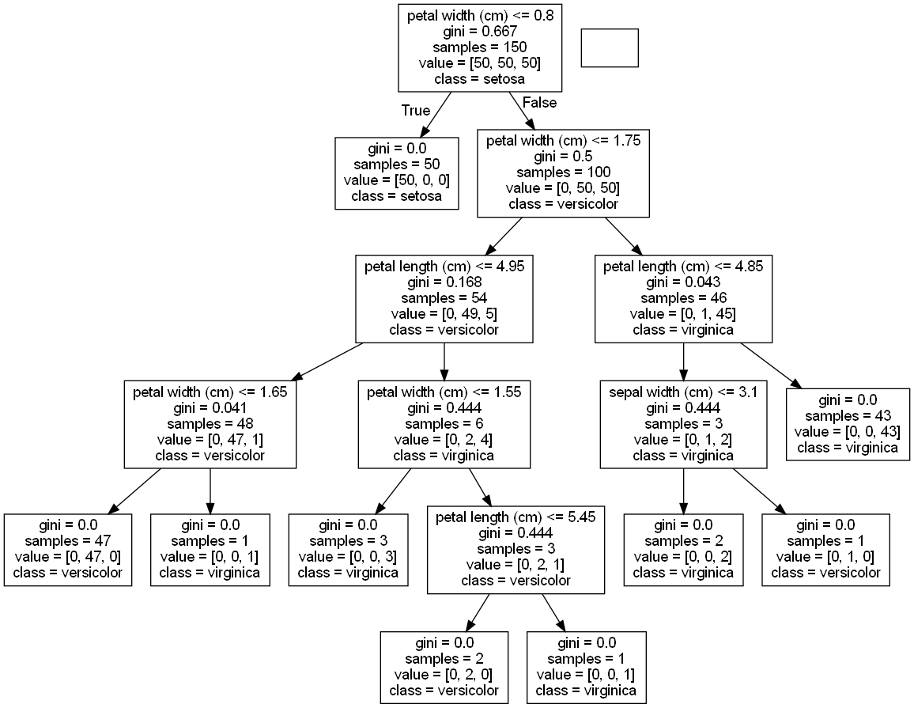
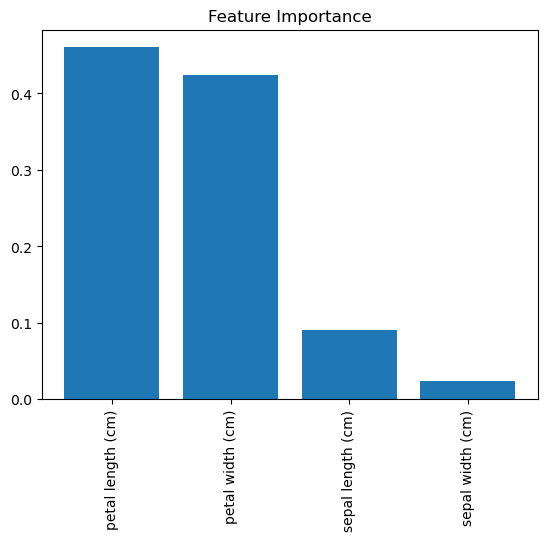

## Summary
***

트리 기반 학습 알고리즘은 분류와 회귀에서 모두 인기있고 널리 사용되는 비모수 지도 학습 방법입니다.
<br><br>


* 결정 트리 분류기 훈련하기 (14.1)
<br><br>


* 결정 트리 회귀 훈련하기 (14.2)
<br><br>


* 결정 트리 모델 시각화하기 (14.3)
<br><br>


* 랜덤 포레스트 분류기 훈련하기 (14.4)
<br><br>


* 랜덤 포레스트 회귀 훈련하기 (14.5)
<br><br>


* 랜덤 포레스트에서 중요한 특성 구분하기 (14.6)
<br><br>


## Practice
***

### 14.0 소개

트리 기반 학습 알고리즘은 분류와 회귀에서 모두 인기있고 널리 사용되는 비모수 지도 학습 방법입니다.
트리 기반 학습기의 기본은 일련의 결정 규칙이 연결된 결정 트리 입니다.
결과물이 뒤집힌 나무와 조금 비슷합니다.
첫 번째 결정 규칙이 맨 위에 있고 이어지는 결정 규칙이 아래로 퍼져 있습니다.
결정 트리에서 모든 결정 규칙은 결정 노드에서 일어납니다.
이 규칙은 새로운 노드로 이어지는 가지를 만듭니다.
결정 규칙이 없는 마지막 가지를 리프(leaf)라고 부릅니다.


트리 기반 모델이 인기 있는 한 가지 이유는 이해하기 쉽기 때문입니다.
기본 트리 시스템은 랜덤 포레스트부터 스태킹까지 광범위하게 적용됩니다.

### 14.1 결정 트리 분류기 훈련하기

결정 트리 학습기는 노드에서 불순도(impurity)가 가장 크게 감소하는 결정 규칙을 찾습니다.
불순도를 측정하는 방법은 많이 있지만 DecisionTreeClassifier는 기본적으로 지니 불순도(Gini impurity)를 사용합니다.


$ G(t) = 1 - \sum_{i=1}^{c} P_{i}^2 $


여기에서 $ G(t) $는 노드 t에서 지니 불순도이고  $ p_{i} $는 노드 t에서 클래스 c의 샘플 비율입니다.
불순도를 낮추는 결정 규칙을 찾는 과정은 모든 leaf node가 순수해지거나(즉, 한 클래스만 남거나) 어떤 임곗값에 도달할 때까지 반복됩니다.

```python
from sklearn.tree import DecisionTreeClassifier
from sklearn import datasets

# 데이터를 로드합니다.
iris = datasets.load_iris()
features = iris.data
target = iris.target

# 결정 트리 분류기를 만듭니다.
decisiontree = DecisionTreeClassifier(random_state=0)

# 모델을 훈련합니다.
model = decisiontree.fit(features, target)

# 새로운 샘플을 만듭니다.
observation = [[5, 4, 3, 2]]

# 샘플의 클래스를 예측합니다.
model.predict(observation)

# 세 개의 클래스에 대한 예측 확률을 확인합니다.
model.predict_proba(observation)
```

```text
array([[0., 1., 0.]])
```

### 14.2 결정 트리 회귀 훈련하기

결정 트리 회귀는 결정 트리 분류와 작동 방식이 비슷합니다.
지니 불순도나 엔트로피를 감소하는 대신 기본적으로 얼마나 평균 제곱 오차(MSE)를 감소시키는지에 따라 분할합니다.


$
MSE = \frac{1}{n}\sum_{i=1}^{n} (y_{i} - \bar{y})^2
$


여기에서 $Y_{i}$는 타깃의 정답값이고 $\bar{y}$는 평균값입니다. 사이킷런에서는 DecisionTreeRegressor를 사용하여 결정 트리 회귀를 수행할 수 있습니다. 결정 트리를 훈련하고 나면 이를 사용해 샘플의 타깃값을 예측할 수 있습니다.

```python
from sklearn.tree import DecisionTreeRegressor
from sklearn import datasets

# 데이터를 로드하고 두 개의 특성만 선택합니다.
boston = datasets.load_iris()
features = boston.data[:, 0:2]
target = boston.target

# 결정 트리 회귀 모델을 만듭니다.
decisiontree = DecisionTreeRegressor(random_state=0)

# 모델을 훈련합니다.
model = decisiontree.fit(features, target)
```

```python
# 새로운 샘플을 만듭니다.
observation = [[0.02, 16]]

# 샘플의 타깃을 예측합니다.
model.predict(observation)

# 평균 절댓값 오차를 사용한 결정 트리 회귀 모델을 훈련합니다.
decisiontree_mae = DecisionTreeRegressor(criterion="friedman_mse", random_state=0)

# 모델을 훈련합니다.
model_mae = decisiontree_mae.fit(features, target)
```

### 14.3 결정 트리 모델 시각화하기

결정 트리 분류기의 장점 중 하나는 훈련된 전체 모델을 시각화할 수 있다는 것입니다.
결정 트리는 머신러닝에서 가장 해석하기 좋은 모델 중 하나입니다.

```python
import pydotplus
from sklearn.tree import DecisionTreeClassifier
from sklearn import datasets
from IPython.display import Image
from sklearn import tree

# 데이터를 로드합니다.
iris = datasets.load_iris()
features = iris.data
target = iris.target

# 결정 트리 분류기를 만듭니다.
decisiontree = DecisionTreeClassifier(random_state=0)

# 모델을 훈련합니다.
model = decisiontree.fit(features, target)

# DOT 데이터를 만듭니다.
dot_data = tree.export_graphviz(
    decisiontree,
    out_file=None,
    feature_names = iris.feature_names,
    class_names = iris.target_names
)

# 그래프를 그립니다.
graph = pydotplus.graph_from_dot_data(dot_data)
Image(graph.create_png())
```



### 14.4 랜덤 포레스트 분류기 훈련하기

결정 트리의 일반적인 문제는 훈련 데이터에 너무 가깝게 맞추려는 경향이 있다는 점입니다. (과대적합)
이런 이유 때문에 랜덤 포레스트라 불리는 방법이 널리 사용됩니다.
랜덤 포레스트는 많은 결정 트리를 훈련하지만 각 트리는 부트스트랩 샘플을 사용합니다.
(즉, 원본 샘플 수와 동일하게 중복을 포함하여 랜덤하게 샘플을 뽑습니다.)
또 각 노드는 최적의 분할을 결정할 때 특성의 일부만 사용합니다.
이 랜덤한 결정 트리의 숲(forest)이 투표하여 예측 클래스를 결정합니다.

```python
from sklearn.ensemble import RandomForestClassifier
from sklearn import datasets

# 데이터를 로드합니다.
iris = datasets.load_iris()
features = iris.data
target = iris.target

# 랜덤 포레스트 분류기 객체를 만듭니다.
randomforest = RandomForestClassifier(random_state=0, n_jobs=-1)

# 모델을 훈련합니다.
model = randomforest.fit(features, target)
```

```python
# 새로운 샘플을 만듭니다.
observation = [[5, 4, 3, 2]]

# 샘플 클래스를 예측합니다.
model.predict(observation)
```

```text
array([1])
```

### 14.5 랜덤 포레스트 회귀 훈련하기

사이킷런의 RandomForestRegressor를 사용하여 랜덤 포레스트 회귀 모델을 훈련할 수 있습니다.


### 14.6 랜덤 포레스트에서 중요한 특성 구분하기

결정 트리의 주요 장점 중 하나는 해석이 용이하다는 것입니다.
특히 전체 모델을 그래프로 나타낼 수 있습니다.
랜덤 포레스트 모델은 수십, 수백 심지어 수천 개의 결정 트리로 구성됩니다.
따라서 간단하고 직관적으로 랜덤 포레스트 모델을 시각화 하는 것은 현실적으로 어렵습니다.
그래서 각 특성의 상대적 중요도를 비교하고 시각화하는 방법을 사용할 수 있습니다.

```python
import numpy as np
import matplotlib.pyplot as plt
from sklearn.ensemble import RandomForestClassifier
from sklearn import datasets

# 데이터를 로드합니다.
iris = datasets.load_iris()
features = iris.data
target = iris.target

# 랜덤 포레스트 분류기 객체를 만듭니다.
randomforest = RandomForestClassifier(random_state=0, n_jobs=-1)

# 모델을 훈련합니다.
model = randomforest.fit(features, target)

# 특성 중요도를 계산합니다.
importances = model.feature_importances_

# 특성 중요도를 내림차순으로 정렬합니다.
indices = np.argsort(importances)[::-1]

# 정렬된 특성 중요도레 따라 특성의 이름을 나열합니다.
names = [iris.feature_names[i] for i in indices]

# 그래프를 만듭니다.
plt.figure()
plt.title("Feature Importance")
plt.bar(range(features.shape[1]), importances[indices])
plt.xticks(range(features.shape[1]), names, rotation=90)
plt.show()
```



특성 중요도에 관해 두 가지를 유념해야 합니다.

1. 사이킷런에서는 순서가 없는 범주형 특성을 여러 개의 이진 특성으로 변환해야 합니다. 특성의 중요도 또한 여러 개의 이진 특성으로 나뉘게 됩니다. 원본 범주형 특성이 아주 중요하더라도 개별 이진 특성은 중요하지 않게 보일 수 있습니다.
2. 두 특성의 상관관계가 크다면 한 특성이 중요하게 나타났을 때 다른 특성은 훨씬 중요하지 않게 보일 것입니다. 이런 상황을 고려하지 않으면 모델 해석이 영향을 받을 것입니다.
