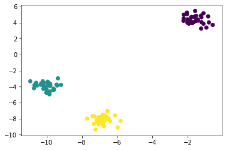

## Summary
***

 Machine learning의 첫 단계는 data를 불러 오는 것입니다. CSV, SQL DB 등 다양한 source에서 data load 방법을 알아봅니다. pandas library 도구를 사용합니다. Toy data set은 scikit-learn을 사용합니다.
 <br><br>


 * Toy Data Set (2.1)
 
   * load_boston: Boston house cose에 대한 503개 data set 입니다. (Regression)

   * load_iris: Iris sample size에 대한 150개 data set 입니다. (Classification)
   
   * load_digits: 손 글씨 숫자 이미지 1,979개 data set 입니다. (Image clustering)
   <br><br>


 * scikit-learn을 사용한 Mock Data Set (2.2)

   * make_regression: regression을 위한 실수 feature matrix와 target vector return

   * make_classification: classification을 위한 실수 feature matrix와 정수 target vector return

   * make_blobs: clustering을 위한 실수 feature matrix와 정수 target vector return
   <br><br>


* Pandas를 사용한 Data Load
    
   * **read_csv**: csv file (2.3)

   * **read_excel**: excel file (2.4)
 
   * **read_json**: json file (2.5)
   
   * **read_sql_query**: SQL database (2.6)
   <br><br>


## Practice
***

### 2.0 소개   
   
머신러닝 작업의 첫 번째 단계는 시스템으로 원본 데이터를 불러오는 것입니다.   
원본 데이터는 로그 파일이나 데이터셋 파일, 데이터베이스일 수 있습니다.   
   
이 장에서는 CSV 파일, SQL 데이터베이스 같은 다양한 소스에서 데이터를 적재하는 방법을 알아봅니다.   
또한 실험에 필요한 특성을 가진 모의 데이터를 생성하는 방법도 알아봅니다.   
   
외부 데이터를 적재할 때는 pandas 라이브러리의 다양한 도구를 사용하고   
모의 데이터를 생성할 때는 파이썬의 오픈 소스 머신러닝 라이브러리인 scikit-learn을 사용합니다.

### 2.1 샘플 데이터셋 적재하기   
   
scikit-learn에는 이미 준비된 데이터셋이 존재합니다.   
이 데이터셋들은 실재 마주하는 데이터와 비교해서 아주 작고 잘 정제되어 있기 때문에 토이 데이터셋이라고 부릅니다.   
scikit-learn에서 자주 사용하는 데이터셋은 다음과 같습니다.   
   
* load_boston   
보스턴 주택 가격에 대한 503개의 샘플을 가지고 있습니다.   
회귀 알고리즘을 배울 때 사용하기 좋은 데이터셋입니다.   
   
   
* load_iris   
150개의 붓꽃 샘플 치수를 가지고 있습니다.   
분류 알고리즘을 배울 때 사용하기 좋은 데이터셋입니다.   
   
   
* load_digits   
손으로 쓴 숫자 이미지 1,979개를 가지고 있습니다.   
이미지 분류 작업을 배울 때 사용하기 좋은 데이터셋입니다.

```python
# scikit-learn의 데이터셋을 적재합니다.
from sklearn import datasets

# 숫자 데이터셋을 적재합니다.
digits = datasets.load_digits()

# 특성 행렬을 만듭니다.
features = digits.data

# 타겟 벡터를 만듭니다.
target = digits.target

# 첫 번째 샘플을 확인합니다.
features[0]
```

```text
array([ 0.,  0.,  5., 13.,  9.,  1.,  0.,  0.,  0.,  0., 13., 15., 10.,
       15.,  5.,  0.,  0.,  3., 15.,  2.,  0., 11.,  8.,  0.,  0.,  4.,
       12.,  0.,  0.,  8.,  8.,  0.,  0.,  5.,  8.,  0.,  0.,  9.,  8.,
        0.,  0.,  4., 11.,  0.,  1., 12.,  7.,  0.,  0.,  2., 14.,  5.,
       10., 12.,  0.,  0.,  0.,  0.,  6., 13., 10.,  0.,  0.,  0.])
```

### 2.2 모의 데이터셋 만들기   
   
선형 회귀에 사용할 데이터셋이 필요할 때는 make_regression이 좋은 선택입니다.   
make_regression은 실수 특성 행렬과 실수 타겟 벡터를 반환합니다.   
n_informative는 타겟 벡터를 생성하는 데 사용할 특성 수를 결정합니다.

```python
from sklearn.datasets import make_regression

# 특성 행렬, 타겟 벡터, 정답계수를 생성합니다.
features, target, coefficients = make_regression(n_samples = 100,
                                                 n_features = 3,
                                                 n_informative = 3,
                                                 n_targets = 1,
                                                 noise = 0.0,
                                                 coef = True,
                                                 random_state = 1)

# 특성 행렬과 타겟 벡터를 확인합니다.
print('특성 행렬\n', features[:3])
print('타겟 벡터\n', target[:3])
```

```text
특성 행렬
 [[ 1.29322588 -0.61736206 -0.11044703]
 [-2.793085    0.36633201  1.93752881]
 [ 0.80186103 -0.18656977  0.0465673 ]]
타겟 벡터
 [-10.37865986  25.5124503   19.67705609]
```

분류에 필요한 모의 데이터셋을 만들려면 make_classification을 사용합니다.   
make_classification은 실수 특성 행렬과 클래스의 소속을 나타내는 정수 타겟 벡터를 반환합니다.   
마찬가지로 n_informative는 타겟 벡터를 생성하는 데 사용할 특성 수를 결정합니다.   
또한 weights 매개변수를 사용해 불균형한 클래스를 가진 모의 데이터셋을 만들 수 있습니다.   
예를 들어 weights = [ .25, .75]는 샘플의 25%가 한 클래스이고 75%가 두 번째 클래스에 속한 데이터셋을 반환합니다.

```python
from sklearn.datasets import make_classification

# 특성 행렬과 타겟 벡터를 생성합니다.
features, target = make_classification(n_samples = 100,
                                       n_features = 3,
                                       n_informative = 3,
                                       n_redundant = 0,
                                       n_classes = 2,
                                       weights = [.25, .75],
                                       random_state = 1)

# 특성 행렬과 타겟 벡터를 확인합니다.
print('특성 행렬\n', features[:3])
print('타겟 벡터\n', target[:3])
```

```text
특성 행렬
 [[ 1.06354768 -1.42632219  1.02163151]
 [ 0.23156977  1.49535261  0.33251578]
 [ 0.15972951  0.83533515 -0.40869554]]
타겟 벡터
 [1 0 0]
```

마지막으로 군집 알고리즘에 적용할 데이터셋이 필요하다면 make_blobs를 사용합니다.   
make_blobs 또한 실수 특성 행렬과 클래스의 소속을 나타내는 정수 타겟 벡터를 반환합니다.   
또한 centers 매개변수가 생성될 클러스터의 수를 결정합니다.

```python
from sklearn.datasets import make_blobs

# 특성 행렬과 타겟 벡터를 생성합니다.
features, target = make_blobs(n_samples = 100,
                              n_features = 2,
                              centers = 3,
                              cluster_std = 0.5,
                              shuffle = True,
                              random_state = 1)

# 특성 행렬과 타겟 벡터를 확인합니다.
print('특성 행렬\n', features[:3])
print('타겟 벡터\n', target[:3])
```

```text
특성 행렬
 [[ -1.22685609   3.25572052]
 [ -9.57463218  -4.38310652]
 [-10.71976941  -4.20558148]]
타겟 벡터
 [0 1 1]
```

matplotlib 그래프 라이브러리를 사용하여 make_blobs에서 생성한 클러스터를 시각화해보겠습니다.

```python
import matplotlib.pyplot as plt

# 산점도를 출력합니다.
plt.scatter(features[:, 0], features[:, 1], c=target)
plt.show()
```



### 2.3 CSV 파일 적재하기   
   
CSV(comma-separated value) 파일을 불러올 때 pandas 라이브러리의 read_csv 함수를 사용합니다.

```python
import pandas as pd

# 데이터 url
url = 'https://tinyurl.com/simulated-data'

# 데이터 적재
dataframe = pd.read_csv(url)

# 처음 두 행을 확인합니다.
dataframe.head(2)
```

```text
   integer             datetime  category
0        5  2015-01-01 00:00:00         0
1        5  2015-01-01 00:00:01         0
```

sep 매개변수는 파일이 사용하는 구분자를 지정할 수 있습니다.   
header 매개변수는 제목 행이 몇 번째 줄인지 지정할 수 있습니다.   
names 매개변수는 header=None인 경우 제목을 설정할 수 있습니다.   
skiprows 매개변수는 건너 뛸 행의 개수나 범위를 지정할 수 있습니다.   
nrows 매개변수는 읽을 행의 개수를 지정할 수 있습니다.

### 2.4 엑셀 파일 적재하기   
   
엑셀 스프레드시트를 불러올 때 pandas 라이브러리의 read_excel 함수를 사용합니다.

```python
#데이터 url
url = 'https://tinyurl.com/simulated-excel'

# 데이터 적재
dataframe = pd.read_excel(url, sheet_name=0, header=1)

# 처음 두 행을 확인합니다.
dataframe.head(2)
```

```text
   5 2015-01-01 00:00:00  0
0  5 2015-01-01 00:00:01  0
1  9 2015-01-01 00:00:02  0
```

read_csv와 비슷하나 주요 차이점은 sheet_name 매개변수를 사용하여 스프레드시트를 선택할 수 있다는 점입니다.   
sheet_name 매개변수는 시트 이름 문자열이나 시트의 위치를 나타내는 정수를 모두 받을 수 있습니다.   
read_excel 함수도 na_filter, skip_rows, nrows, keep_default_na, na_values 매개변수를 지원합니다.

### 2.5 JSON 파일 적재하기   
   
json 파일을 불러올 때 pandas 라이브러리의 read_json 함수를 사용합니다.

```python
# 데이터 url
url = 'https://tinyurl.com/simulated-json'

# 데이터 적재
dataframe = pd.read_json(url, orient='columns')

# 처음 두 행을 확인합니다.
dataframe.head(2)
```

```text
   integer            datetime  category
0        5 2015-01-01 00:00:00         0
1        5 2015-01-01 00:00:01         0
```

앞에서 살펴본 함수와 비슷하지만 주요 차이점은 json 파일이 어떻게 구성되었는지 지정하는 orient 매개변수를 사용한다는 점 입니다.   
'column'은 json 파일이 {열: {인덱스: 값, ...}, ...} 의 구조를 가질 때 사용합니다.   
그 외 json 파일 구조에 따라 split, records, index, values를 사용합니다.

### 2.6 SQL 데이터베이스로부터 적재하기   
   
SQL(structured query language) 데이터베이스는   
pandas의 read_sql_query 함수를 사용하여 데이터베이스에 SQL 쿼리를 던져 데이터를 적재합니다.

```python
from sqlalchemy import create_engine

# 데이터베이스에 연결합니다.
database_connection = create_engine('sqlite:///sample.db')

# 데이터를 적재합니다.
dataframe = pd.read_sql_query('SELECT * FROM data', database_connection)

# 처음 두 개의 행을 확인합니다.
dataframe.head(2)
```

```text
---------------------------------------------------------------------------
OperationalError                          Traceback (most recent call last)
D:\anaconda\lib\site-packages\sqlalchemy\engine\base.py in _execute_context(self, dialect, constructor, statement, parameters, *args)
   1265                 if not evt_handled:
-> 1266                     self.dialect.do_execute_no_params(
   1267                         cursor, statement, context

D:\anaconda\lib\site-packages\sqlalchemy\engine\default.py in do_execute_no_params(self, cursor, statement, context)
    595     def do_execute_no_params(self, cursor, statement, context=None):
--> 596         cursor.execute(statement)
    597 

OperationalError: no such table: data

The above exception was the direct cause of the following exception:

OperationalError                          Traceback (most recent call last)
<ipython-input-24-796ef047a7c2> in <module>
      5 
      6 # 데이터를 적재합니다.
----> 7 dataframe = pd.read_sql_query('SELECT * FROM data', database_connection)
      8 
      9 # 처음 두 개의 행을 확인합니다.

D:\anaconda\lib\site-packages\pandas\io\sql.py in read_sql_query(sql, con, index_col, coerce_float, params, parse_dates, chunksize)
    375     """
    376     pandas_sql = pandasSQL_builder(con)
--> 377     return pandas_sql.read_query(
    378         sql,
    379         index_col=index_col,

D:\anaconda\lib\site-packages\pandas\io\sql.py in read_query(self, sql, index_col, coerce_float, parse_dates, params, chunksize)
   1293         args = _convert_params(sql, params)
   1294 
-> 1295         result = self.execute(*args)
   1296         columns = result.keys()
   1297 

D:\anaconda\lib\site-packages\pandas\io\sql.py in execute(self, *args, **kwargs)
   1159     def execute(self, *args, **kwargs):
   1160         """Simple passthrough to SQLAlchemy connectable"""
-> 1161         return self.connectable.execution_options(no_parameters=True).execute(
   1162             *args, **kwargs
   1163         )

D:\anaconda\lib\site-packages\sqlalchemy\engine\base.py in execute(self, statement, *multiparams, **params)
   2233 
   2234         connection = self._contextual_connect(close_with_result=True)
-> 2235         return connection.execute(statement, *multiparams, **params)
   2236 
   2237     def scalar(self, statement, *multiparams, **params):

D:\anaconda\lib\site-packages\sqlalchemy\engine\base.py in execute(self, object_, *multiparams, **params)
   1001         """
   1002         if isinstance(object_, util.string_types[0]):
-> 1003             return self._execute_text(object_, multiparams, params)
   1004         try:
   1005             meth = object_._execute_on_connection

D:\anaconda\lib\site-packages\sqlalchemy\engine\base.py in _execute_text(self, statement, multiparams, params)
   1170         dialect = self.dialect
   1171         parameters = _distill_params(multiparams, params)
-> 1172         ret = self._execute_context(
   1173             dialect,
   1174             dialect.execution_ctx_cls._init_statement,

D:\anaconda\lib\site-packages\sqlalchemy\engine\base.py in _execute_context(self, dialect, constructor, statement, parameters, *args)
   1314 
   1315         except BaseException as e:
-> 1316             self._handle_dbapi_exception(
   1317                 e, statement, parameters, cursor, context
   1318             )

D:\anaconda\lib\site-packages\sqlalchemy\engine\base.py in _handle_dbapi_exception(self, e, statement, parameters, cursor, context)
   1508                 util.raise_(newraise, with_traceback=exc_info[2], from_=e)
   1509             elif should_wrap:
-> 1510                 util.raise_(
   1511                     sqlalchemy_exception, with_traceback=exc_info[2], from_=e
   1512                 )

D:\anaconda\lib\site-packages\sqlalchemy\util\compat.py in raise_(***failed resolving arguments***)
    180 
    181         try:
--> 182             raise exception
    183         finally:
    184             # credit to

D:\anaconda\lib\site-packages\sqlalchemy\engine\base.py in _execute_context(self, dialect, constructor, statement, parameters, *args)
   1264                             break
   1265                 if not evt_handled:
-> 1266                     self.dialect.do_execute_no_params(
   1267                         cursor, statement, context
   1268                     )

D:\anaconda\lib\site-packages\sqlalchemy\engine\default.py in do_execute_no_params(self, cursor, statement, context)
    594 
    595     def do_execute_no_params(self, cursor, statement, context=None):
--> 596         cursor.execute(statement)
    597 
    598     def is_disconnect(self, e, connection, cursor):

OperationalError: (sqlite3.OperationalError) no such table: data
[SQL: SELECT * FROM data]
(Background on this error at: http://sqlalche.me/e/13/e3q8)
```
