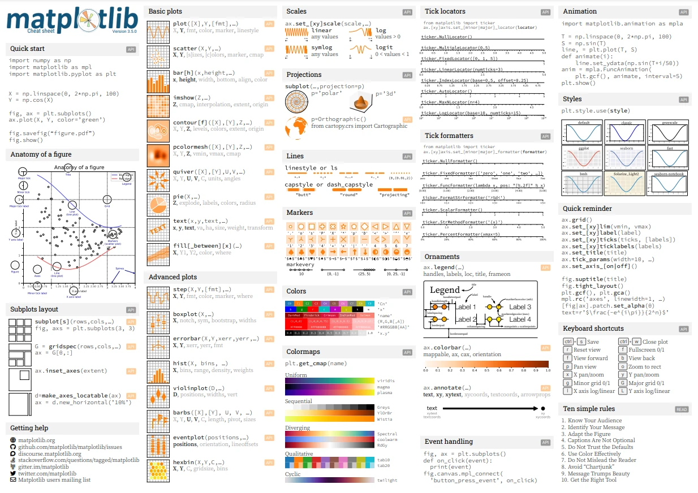
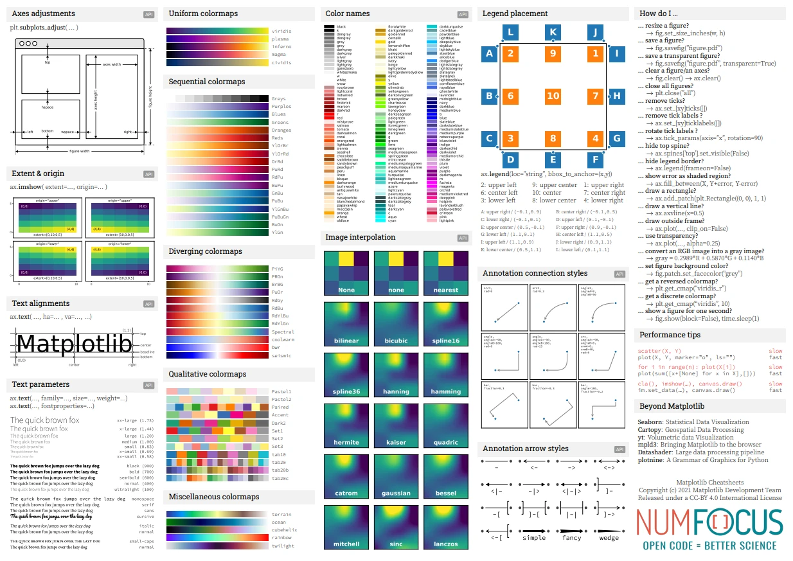
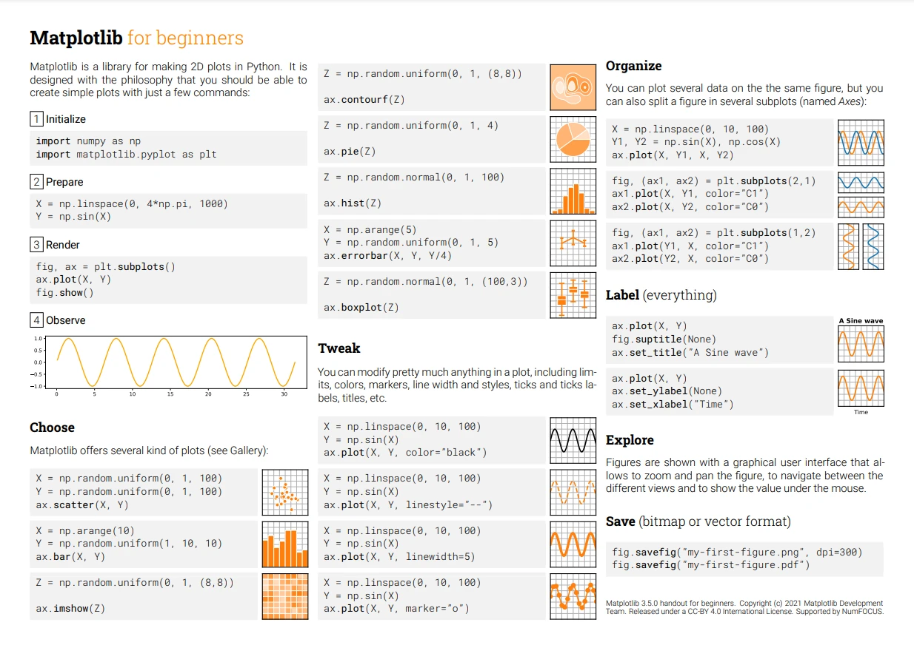
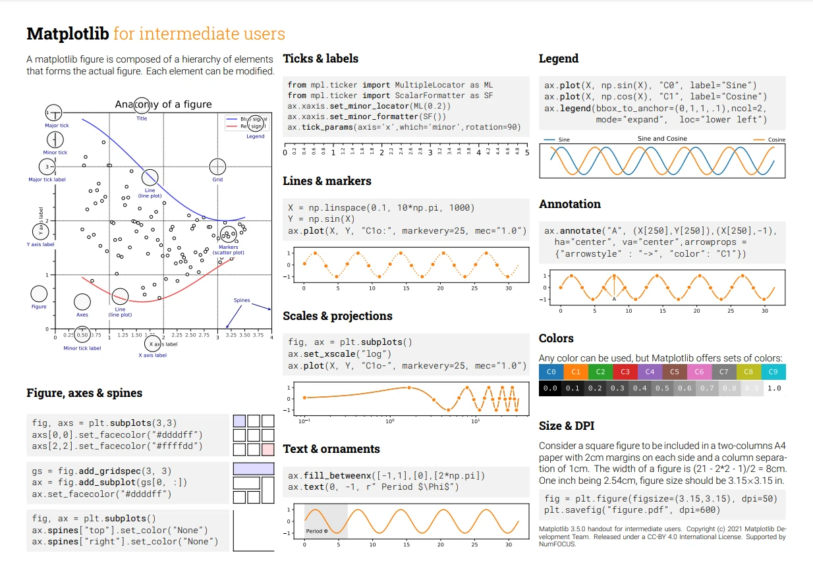
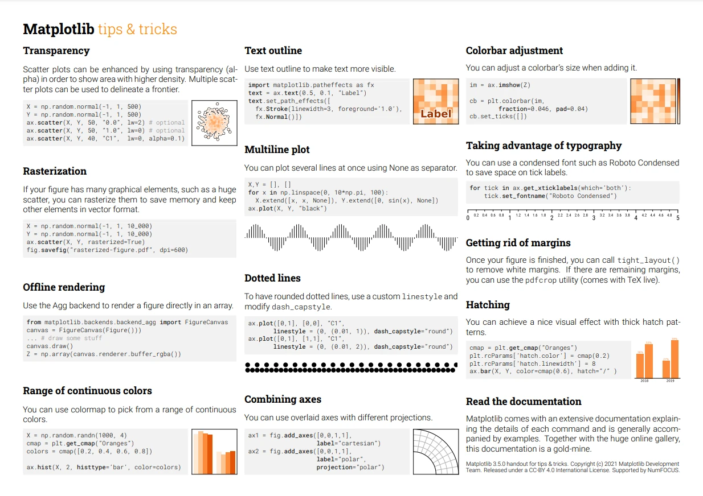

_Cheetsheet - Matplotlib (beginner) 
https://matplotlib.org/cheatsheets/_
 

[Cheetsheet - Matplotlib (beginner)](https://matplotlib.org/cheatsheets/handout-beginner.pdf)
  

_Cheetsheet - Matplotlib (intermediate) 
https://matplotlib.org/cheatsheets/_
 

[Cheetsheet - Matplotlib (intermediate)](https://matplotlib.org/cheatsheets/handout-intermediate.pdf)
  

_Cheetsheet - Matplotlib (tips) 
https://matplotlib.org/cheatsheets/_
 

[Cheetsheet - Matplotlib (tips)](https://matplotlib.org/cheatsheets/handout-tips.pdf)
  

_Cheetsheet - Matplotlib 
https://matplotlib.org/cheatsheets/_
 

_Cheetsheet - Matplotlib 
https://matplotlib.org/cheatsheets/_
 

[Cheetsheet - Matplotlib](https://matplotlib.org/cheatsheets/cheatsheets.pdf)
