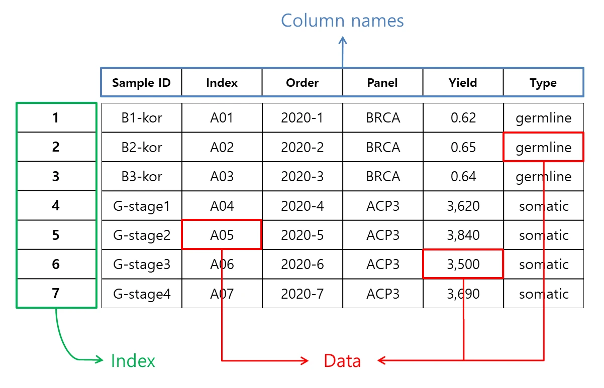
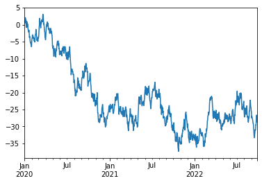
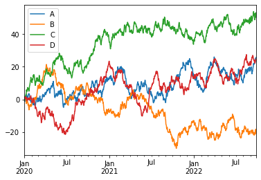

## Intro
***

 Pandas는 data analysis에 유용한 python package 입니다. Pandas는 쉽고 편리하게 data를 다룰 수 있도록 유연한 structure를 제공하는데, 그 중 하나가 바로 Dataframe 입니다.

 이 post는 pandas 공식 가이드 내 [10 minutes to pandas](https://pandas.pydata.org/pandas-docs/stable/user_guide/10min.html, "10 minutes to pandas")를 참고 했습니다.
 <br><br>
 

## Dataframe이란? 
***
 Dataframe은 data를 직사각형 모양 table에 저장한 구조입니다. Row는 숫자, 문자, 논리 등 여러 가지 data type이 들어갈 수 있습니다. Column은 동일한 data type이 들어갈 수 있습니다. 즉, 각 column에 아마도 서로 다른 data type을 지닌 2d array data 구조로 요약할 수 있습니다. 참고로 1d array data 구조는 Series 입니다.

 R 언어를 알고 계시는 분들은 data.frame이 친숙할 것입니다. Pandas의 dataframe과 유사한 구조입니다.

 Dataframe의 주요 요소입니다.

 * Data: Dataframe 자체가 들어갈 수 있고 그 외 series, numpy의 ndarray, 2d ndarray, dictionary가 들어갈 수 있습니다.

 * Index: Numpy의 array나 2d array와 비슷하지만, dataframe에는 index가 존재한다는 차이가 있습니다.

 * Column: Column의 index도 존재하여 data를 손쉽게 다룰 수 있도록 도와줍니다.

 
 _Dataframe 주요 요소_
 <br><br>
 

## Manipulating Dataframe
***


## &nbsp;&nbsp;Object creation
***
 Dataframe을 생성합니다.

### Import required libraries

#### Numpy와 Pandas를 import 합니다.

```python
import numpy as np
import pandas as pd
```

***
***

### Object creation

#### pandas에 list를 넘겨 'Series'를 만들어 봅시다.
#### Index는 기본 설정을 사용합니다. 0부터 시작하여 1씩 증가합니다.

```python
s = pd.Series([1, 3, 5, 7, 9])
s
```

```text
0    1
1    3
2    5
3    7
4    9
dtype: int64
```

#### pandas에 NumPy array를 넘겨 'DataFrame'을 만들어 봅시다.
#### Index는 연속된 날짜를, column name은 A, B, C를 사용합니다.

```python
dates = pd.date_range('20200717', periods=6)
dates
```

```text
DatetimeIndex(['2020-07-17', '2020-07-18', '2020-07-19', '2020-07-20',
               '2020-07-21', '2020-07-22'],
              dtype='datetime64[ns]', freq='D')
```

```python
df = pd.DataFrame(
        np.random.randn(6, 3), # NumPy array
        index=dates,
        columns=list('ABC')
        )
df
```

```text
                   A         B         C
2020-07-17 -0.649036  1.194016 -1.671976
2020-07-18 -0.551816 -2.254361 -0.109569
2020-07-19 -0.914518 -0.385325  0.259745
2020-07-20 -0.029484  0.119984 -0.299513
2020-07-21 -0.302863  0.004918 -0.671543
2020-07-22 -0.615118 -1.382085  0.226391
```

***

#### pandas에 series와 유사하게 변형될 수 있는 형태의 dictionary를 넘겨 'DataFrame'을 만들어 봅시다.
#### Index는 기본 설정이, column name은 dictionary의 key가 들어갑니다.

```python
df2 = pd.DataFrame({
            'A': 1.,
            'B': pd.Timestamp('20200701'),
            'C': pd.Series(1, index=list(range(4)), dtype='float32'),
            'D': np.array([3] * 4, dtype='int32'),
            'E': pd.Categorical(["test", "train", "test", "train"]),
            'F': 'foo'
            })
df2
```

```text
     A          B    C  D      E    F
0  1.0 2020-07-01  1.0  3   test  foo
1  1.0 2020-07-01  1.0  3  train  foo
2  1.0 2020-07-01  1.0  3   test  foo
3  1.0 2020-07-01  1.0  3  train  foo
```

#### df2는 column별로 다른 data type으로 구성되어 있습니다.
#### 소수점은 'float64', 문자는 'object' 자료형이 할당됩니다.

```python
df2.dtypes
```

```text
A           float64
B    datetime64[ns]
C           float32
D             int32
E          category
F            object
dtype: object
```

***

#### df2.\<TAB\> 혹은 dir(df2)를 실행하면 DataFrame(df2)이 가지고 있는 속성을 확인할 수 있습니다.

```python
dir(df2)
```

```text
['A',
 'B',
 'C',
 '...',
 'var',
 'where',
 'xs']
```
 <br><br>
 

## &nbsp;&nbsp;Viewing data
***
 생성한 dataframe을 확인합니다. 간단한 statistics summary, 행렬변환, 정렬 등을 시도해 보겠습니다.

#### 앞서 진행한 import와 DataFrame 생성을 반복합니다.

```python
import numpy as np
import pandas as pd

dates = pd.date_range('20200724', periods=6)
df = pd.DataFrame(
        np.random.randn(6, 4),
        index=dates,
        columns=list('ABCD')
        )
```

***
***

### Viewing data

#### DataFrame의 처음과 끝 부분을 출력해 봅시다.

```python
df.head()
```

```text
                   A         B         C         D
2020-07-24 -0.165906  1.178056  0.018960  0.032754
2020-07-25 -0.194626  0.387675  0.400168  0.236478
2020-07-26 -0.667234 -0.513509 -1.760879 -1.337563
2020-07-27 -1.291120  0.151518  0.231840  0.066671
2020-07-28  0.229097  1.285831 -0.852687  0.366998
```

```python
df.tail(3)
```

```text
                   A         B         C         D
2020-07-27 -1.291120  0.151518  0.231840  0.066671
2020-07-28  0.229097  1.285831 -0.852687  0.366998
2020-07-29  1.640661 -0.006239  0.494051 -1.189063
```

***

#### DataFrame의 index와 column name도 출력해 봅시다.

```python
df.index
```

```text
DatetimeIndex(['2020-07-24', '2020-07-25', '2020-07-26', '2020-07-27',
               '2020-07-28', '2020-07-29'],
              dtype='datetime64[ns]', freq='D')
```

```python
df.columns
```

```text
Index(['A', 'B', 'C', 'D'], dtype='object')
```

***

#### describe()는 DataFrame의 요약통계치를 빠르게 보여줍니다.

```python
df.describe()
```

```text
              A         B         C         D
count  6.000000  6.000000  6.000000  6.000000
mean  -0.074855  0.413889 -0.244758 -0.303954
std    0.988760  0.700048  0.886190  0.754287
min   -1.291120 -0.513509 -1.760879 -1.337563
25%   -0.549082  0.033200 -0.634775 -0.883609
50%   -0.180266  0.269597  0.125400  0.049712
75%    0.130346  0.980461  0.358086  0.194027
max    1.640661  1.285831  0.494051  0.366998
```

*** 

#### DataFrame의 행과 열을 뒤바꿀 수도 있습니다.

```python
df.T
```

```text
   2020-07-24  2020-07-25  2020-07-26  2020-07-27  2020-07-28  2020-07-29
A   -0.165906   -0.194626   -0.667234   -1.291120    0.229097    1.640661
B    1.178056    0.387675   -0.513509    0.151518    1.285831   -0.006239
C    0.018960    0.400168   -1.760879    0.231840   -0.852687    0.494051
D    0.032754    0.236478   -1.337563    0.066671    0.366998   -1.189063
```

***

#### DataFrame의 정렬기능은 index에 따라, column name에 따라, 혹은 특정 value에 따라 가능합니다.

```python
df.sort_index() # sorting by index
```

```text
                   A         B         C         D
2020-07-24 -0.165906  1.178056  0.018960  0.032754
2020-07-25 -0.194626  0.387675  0.400168  0.236478
2020-07-26 -0.667234 -0.513509 -1.760879 -1.337563
2020-07-27 -1.291120  0.151518  0.231840  0.066671
2020-07-28  0.229097  1.285831 -0.852687  0.366998
2020-07-29  1.640661 -0.006239  0.494051 -1.189063
```

```python
df.sort_index(axis=1, ascending=False) # sorting by column name in descending order
```

```text
                   D         C         B         A
2020-07-24  0.032754  0.018960  1.178056 -0.165906
2020-07-25  0.236478  0.400168  0.387675 -0.194626
2020-07-26 -1.337563 -1.760879 -0.513509 -0.667234
2020-07-27  0.066671  0.231840  0.151518 -1.291120
2020-07-28  0.366998 -0.852687  1.285831  0.229097
2020-07-29 -1.189063  0.494051 -0.006239  1.640661
```

```python
df.sort_values(by='B') # sorting by values in 'B' column
```

```text
                   A         B         C         D
2020-07-26 -0.667234 -0.513509 -1.760879 -1.337563
2020-07-29  1.640661 -0.006239  0.494051 -1.189063
2020-07-27 -1.291120  0.151518  0.231840  0.066671
2020-07-25 -0.194626  0.387675  0.400168  0.236478
2020-07-24 -0.165906  1.178056  0.018960  0.032754
2020-07-28  0.229097  1.285831 -0.852687  0.366998
```
 <br><br>
 

## &nbsp;&nbsp;Selection
***
 Data를 선택하고 변경하는 방법입니다.

#### 앞서 진행한 import와 DataFrame 생성을 반복합니다.

```python

import numpy as np
import pandas as pd

dates = pd.date_range('20200724', periods=6)
df = pd.DataFrame(
        np.random.randn(6, 4),
        index=dates,
        columns=list('ABCD')
        )
```

#### Data를 분석하려면 특정 값을 선택해서 다루거나 출력할 필요가 있습니다.

#### 이 때 사용할 수 있는 기능들을 살펴 보겠습니다.

***

### Getting

#### 하나의 column을 선택합니다. 'Series' 형태의 결과를 생성합니다.

```python

df['A'] # selecting a single column
```

```text
2020-07-24    0.769295
2020-07-25   -0.501942
2020-07-26   -1.569191
2020-07-27   -0.861305
2020-07-28    1.572154
2020-07-29   -0.287700
Freq: D, Name: A, dtype: float64
```

#### [ ]를 이용하여 복수의 행을 잘라 선택할 수 있습니다.

```python

df[0:3] # selecting rows
```

```text
                   A         B         C         D
2020-07-24  0.769295  0.844431 -0.918174 -0.047887
2020-07-25 -0.501942  0.097646 -0.963513 -0.260229
2020-07-26 -1.569191  0.257844 -1.276382  0.620355
```

```python

df['2020-07-25':'2020-07-28'] # selecting rows
```

```text
                   A         B         C         D
2020-07-25 -0.501942  0.097646 -0.963513 -0.260229
2020-07-26 -1.569191  0.257844 -1.276382  0.620355
2020-07-27 -0.861305 -0.123141 -0.729888  0.465927
2020-07-28  1.572154  0.227942  0.125129  0.278978
```

***

### Selection by label


#### Index name이나 column name으로 선택할 수 있습니다.

#### 'loc'을 사용합니다.

#### 첫 번째 Index에 해당하는 모든 데이터를 가져와 보겠습니다.

```python

df.loc[dates[0]]
```

```text
A    0.769295
B    0.844431
C   -0.918174
D   -0.047887
Name: 2020-07-24 00:00:00, dtype: float64
```

#### 두 개의 column name에 해당하는 모든 데이터를 가져와 보겠습니다.

```python

df.loc[:, ['A', 'B']]
```

```text
                   A         B
2020-07-24  0.769295  0.844431
2020-07-25 -0.501942  0.097646
2020-07-26 -1.569191  0.257844
2020-07-27 -0.861305 -0.123141
2020-07-28  1.572154  0.227942
2020-07-29 -0.287700  0.835631
```

#### 이번에는 index name과 column name 모두 조건에 만족하는 데이터를 가져와 보겠습니다.

```python

df.loc['2020-07-25':'2020-07-26', ['A', 'B']]
```

```text
                   A         B
2020-07-25 -0.501942  0.097646
2020-07-26 -1.569191  0.257844
```

```python

df.loc['2020-07-25', ['A', 'B']]
```

```text
A   -0.501942
B    0.097646
Name: 2020-07-25 00:00:00, dtype: float64
```

#### 특정 위치의 한 개 값을 가져와 보겠습니다.

#### 'loc'과 'at' 모두 사용할 수 있습니다.

```python

df.loc[dates[0], 'A']
```

```text
0.7692952378187148
```

```python

df.at[dates[0], 'A']
```

```text
0.7692952378187148
```

***

### Selection by position

#### 이번에는 index와 column 모두 위치를 기준으로 데이터를 선택하는 방법에 대해서 알아보겠습니다.

#### 여기서 사용하는 위치는 python에서 사용하는 index 개념과 동일합니다.

#### 'iloc'을 사용합니다.

#### 먼저 하나의 단일 위치를 사용할 수 있습니다.

```python

df.iloc[3]
```

```text
A   -0.861305
B   -0.123141
C   -0.729888
D    0.465927
Name: 2020-07-27 00:00:00, dtype: float64
```

#### 다음은 행과 열 모두 범위 단위 인덱스 정보를 사용한 예 입니다.

```python

df.iloc[3:5, 0:2]
```

```text
                   A         B
2020-07-27 -0.861305 -0.123141
2020-07-28  1.572154  0.227942
```

#### 또한 list 형태로 위치를 사용할 수도 있습니다.

```python

df.iloc[
        [1, 2, 4],
        [0, 2]
        ]
```

```text
                   A         C
2020-07-25 -0.501942 -0.963513
2020-07-26 -1.569191 -1.276382
2020-07-28  1.572154  0.125129
```

#### label을 사용했을 때와 마찬가지로 행이나 열을 선택할 수도 있습니다.

```python

df.iloc[1:3, :] # selecting by row index
```

```text
                   A         B         C         D
2020-07-25 -0.501942  0.097646 -0.963513 -0.260229
2020-07-26 -1.569191  0.257844 -1.276382  0.620355
```

```python

df.iloc[:, 1:3] # selecting by column index
```

```text
                   B         C
2020-07-24  0.844431 -0.918174
2020-07-25  0.097646 -0.963513
2020-07-26  0.257844 -1.276382
2020-07-27 -0.123141 -0.729888
2020-07-28  0.227942  0.125129
2020-07-29  0.835631  1.684919
```

#### 역시 특정 위치를 선택하여 하나의 value만 선택할 수도 있습니다.

#### 'iloc'과 'iat' 모두 사용할 수 있습니다.

```python

df.iloc[1, 1]
```

```text
0.09764616018895249
```

```python

df.iat[1, 1]
```

```text
0.09764616018895249
```

***

### Boolean indexing

#### 논리에 따라 해당되는 값을 선택하는 방법을 알아보겠습니다.

#### 특정 column의 값들 중 조건에 해당하는 data만 선택하는 방법입니다.

```python

df[df['A'] > 0] # select if the 'A' columne's value is greater than 0
```

```text
                   A         B         C         D
2020-07-24  0.769295  0.844431 -0.918174 -0.047887
2020-07-28  1.572154  0.227942  0.125129  0.278978
```

#### 전체 DataFrame 값 중 조건을 충족하는 data만 선택할 수도 있습니다.

#### 이 때 조건을 충족하지 못하는 data는 모두 NaN으로 표기됩니다.

```python

df[df > 0]
```

```text
                   A         B         C         D
2020-07-24  0.769295  0.844431       NaN       NaN
2020-07-25       NaN  0.097646       NaN       NaN
2020-07-26       NaN  0.257844       NaN  0.620355
2020-07-27       NaN       NaN       NaN  0.465927
2020-07-28  1.572154  0.227942  0.125129  0.278978
2020-07-29       NaN  0.835631  1.684919  0.506765
```

#### isin() method를 사용해서 filter 할 수도 있습니다.

```python

df2 = df.copy()
df2['E'] = ['one', 'one', 'two', 'three', 'four', 'three']
df2
```

```text
                   A         B         C         D      E
2020-07-24  0.769295  0.844431 -0.918174 -0.047887    one
2020-07-25 -0.501942  0.097646 -0.963513 -0.260229    one
2020-07-26 -1.569191  0.257844 -1.276382  0.620355    two
2020-07-27 -0.861305 -0.123141 -0.729888  0.465927  three
2020-07-28  1.572154  0.227942  0.125129  0.278978   four
2020-07-29 -0.287700  0.835631  1.684919  0.506765  three
```

```python

df2[df2['E'].isin(['two', 'four'])] # select if the 'E' column's value is 'two' or 'four'
```

```text
                   A         B         C         D     E
2020-07-26 -1.569191  0.257844 -1.276382  0.620355   two
2020-07-28  1.572154  0.227942  0.125129  0.278978  four
```

***

### Setting

#### DataFrame의 data를 변경할 수 있습니다.

#### 먼저 DataFrame에 새로운 column을 추가하는 방법을 알아보겠습니다.

#### index를 가지고 있는 Series를 만들고 DataFrame의 새로운 column을 지정하여 추가할 수 있습니다.

```python

new_s1 = pd.Series(
        [1, 2, 3, 4, 5, 6],
        index=pd.date_range('20200725', periods=6)
        )

new_s1
```

```text
2020-07-25    1
2020-07-26    2
2020-07-27    3
2020-07-28    4
2020-07-29    5
2020-07-30    6
Freq: D, dtype: int64
```

```python

df['F'] = new_s1 # assign Series to DataFrame's 'F' column

df
```

```text
                   A         B         C         D    F
2020-07-24  0.769295  0.844431 -0.918174 -0.047887  NaN
2020-07-25 -0.501942  0.097646 -0.963513 -0.260229  1.0
2020-07-26 -1.569191  0.257844 -1.276382  0.620355  2.0
2020-07-27 -0.861305 -0.123141 -0.729888  0.465927  3.0
2020-07-28  1.572154  0.227942  0.125129  0.278978  4.0
2020-07-29 -0.287700  0.835631  1.684919  0.506765  5.0
```

#### label을 사용하여 data를 수정할 수도 있습니다.

```python

df.at[dates[0], 'A'] = 0
df
```

```text
                   A         B         C         D    F
2020-07-24  0.000000  0.844431 -0.918174 -0.047887  NaN
2020-07-25 -0.501942  0.097646 -0.963513 -0.260229  1.0
2020-07-26 -1.569191  0.257844 -1.276382  0.620355  2.0
2020-07-27 -0.861305 -0.123141 -0.729888  0.465927  3.0
2020-07-28  1.572154  0.227942  0.125129  0.278978  4.0
2020-07-29 -0.287700  0.835631  1.684919  0.506765  5.0
```

#### 위치 정보를 사용하여 data를 수정할 수도 있습니다.

```python

df.iat[0, 1] = 0
df
```

```text
                   A         B         C         D    F
2020-07-24  0.000000  0.000000 -0.918174 -0.047887  NaN
2020-07-25 -0.501942  0.097646 -0.963513 -0.260229  1.0
2020-07-26 -1.569191  0.257844 -1.276382  0.620355  2.0
2020-07-27 -0.861305 -0.123141 -0.729888  0.465927  3.0
2020-07-28  1.572154  0.227942  0.125129  0.278978  4.0
2020-07-29 -0.287700  0.835631  1.684919  0.506765  5.0
```

#### data를 수정할 때 numpy array를 대응시켜 특정 column data를 모두 수정할 수도 있습니다.

```python

df.loc[:, 'D'] = np.array([5] * len(df))
df
```

```text
                   A         B         C  D    F
2020-07-24  0.000000  0.000000 -0.918174  5  NaN
2020-07-25 -0.501942  0.097646 -0.963513  5  1.0
2020-07-26 -1.569191  0.257844 -1.276382  5  2.0
2020-07-27 -0.861305 -0.123141 -0.729888  5  3.0
2020-07-28  1.572154  0.227942  0.125129  5  4.0
2020-07-29 -0.287700  0.835631  1.684919  5  5.0
```

#### 마지막으로 조건에 해당하는 data 값들을 모두 음수로 변환해 보겠습니다.

```python

df2 = df.copy()
df2[df2 > 0] = -df2
df2
```

```text
                   A         B         C  D    F
2020-07-24  0.000000  0.000000 -0.918174 -5  NaN
2020-07-25 -0.501942 -0.097646 -0.963513 -5 -1.0
2020-07-26 -1.569191 -0.257844 -1.276382 -5 -2.0
2020-07-27 -0.861305 -0.123141 -0.729888 -5 -3.0
2020-07-28 -1.572154 -0.227942 -0.125129 -5 -4.0
2020-07-29 -0.287700 -0.835631 -1.684919 -5 -5.0
```
 <br><br>
 

## &nbsp;&nbsp;Missing data
***
 결측치를 확인하고 처리하는 방법입니다.

### 앞서 진행한 import와 DataFrame 생성을 반복합니다.

```python

import numpy as np
import pandas as pd

dates = pd.date_range('20200724', periods=6)
df = pd.DataFrame(
        np.random.randn(6, 4),
        index=dates,
        columns=list('ABCD')
        )
```

### pandas에서는 결측치(missing data)를 주로 'np.nan'으로 표현합니다.

### 이번에는 결측치(missing data)를 다루는 방법에 대해 살펴보겠습니다.

### 'reindex'는 특정 column의 index를 수정/추가/삭제 할 수 있습니다.

### 그 결과 복사된 DataFrame을 반환합니다.

```python

df1 = df.reindex(
        index=dates[0:4],
        columns=list(df.columns) + ['E']
        )
df1.loc[dates[0]:dates[1], 'E'] = 1
df1
```

```text
                   A         B         C         D    E
2020-07-24  0.301247 -0.425514 -1.233032  0.259611  1.0
2020-07-25  1.090123 -1.035311  1.168112 -1.214599  1.0
2020-07-26  1.266217  0.809175 -0.578900 -0.658111  NaN
2020-07-27 -0.911602  0.208199  0.596766  1.066030  NaN
```

### missing data가 하나라도 포함된 행을 제외시켜 봅시다.

### 'dropna'를 사용합니다.

```python

df1.dropna(how='any')
```

```text
                   A         B         C         D    E
2020-07-24  0.301247 -0.425514 -1.233032  0.259611  1.0
2020-07-25  1.090123 -1.035311  1.168112 -1.214599  1.0
```

### missing data를 특정 값으로 채워봅시다.

### 'fillna'를 사용합니다.

```python

df1.fillna(value=5)
```

```text
                   A         B         C         D    E
2020-07-24  0.301247 -0.425514 -1.233032  0.259611  1.0
2020-07-25  1.090123 -1.035311  1.168112 -1.214599  1.0
2020-07-26  1.266217  0.809175 -0.578900 -0.658111  5.0
2020-07-27 -0.911602  0.208199  0.596766  1.066030  5.0
```

### data 값이 'nan'인지 아닌지 확인만 해봅시다.

### 'isna'를 사용합니다.

```python

pd.isna(df1)
```

```text
                A      B      C      D      E
2020-07-24  False  False  False  False  False
2020-07-25  False  False  False  False  False
2020-07-26  False  False  False  False   True
2020-07-27  False  False  False  False   True
```
 <br><br>
 

## &nbsp;&nbsp;Operations
***
 본격적으로 data를 다뤄봅니다. Statistics를 구하고 사칙연산 function을 적용합니다.

#### 앞서 진행한 import와 DataFrame 생성을 반복합니다.

```python

import numpy as np
import pandas as pd

dates = pd.date_range('20200724', periods=6)
df = pd.DataFrame(
        np.random.randn(6, 4),
        index=dates,
        columns=list('ABCD')
        )
df
```

```text
                   A         B         C         D
2020-07-24 -0.910768  0.416166  0.197304  0.252876
2020-07-25  0.615104  1.164349  0.044059 -1.996138
2020-07-26 -1.354868 -0.017010 -0.784717  1.337247
2020-07-27 -0.414421  0.992017  1.257737 -0.361511
2020-07-28 -0.194671 -1.427558  0.896521  0.110179
2020-07-29  1.486213  0.975022 -0.125846  1.531045
```

#### DataFrame의 연산을 살펴보겠습니다.

***


### Stats


#### 일반적으로 연산에서 missing data는 제외합니다.

#### 우선 기술통계(descriptive statistic)를 수행해 보겠습니다.

#### 각 column 별로 평균값을 구해봅시다.

```python

df.mean()
```

```text
A    0.231753
B   -0.123741
C    0.078004
D   -0.031127
dtype: float64
```

#### 이번에는 각 index 별로 평균값을 구해봅시다.

```python

df.mean(1)
```

```text
2020-07-24    0.410100
2020-07-25   -0.124489
2020-07-26    0.140944
2020-07-27   -0.362837
2020-07-28    0.360954
2020-07-29   -0.192337
Freq: D, dtype: float64
```

#### 서로 다른 차원을 가진 object 끼리 연산하려면, 하나의 축을 기준으로 서로 맞춰줘야 합니다.

#### pandas는 기준이 되는 축을 지정해주면 자동으로 맞춰 연산을 진행합니다.

#### 이 때 missing data는 연산할 수 없으므로 모두 nan으로 변환됩니다.

```python

s = pd.Series([1, 3, 5, np.nan, 6, 8], index=dates).shift(2)
s
```

```text
2020-07-24    NaN
2020-07-25    NaN
2020-07-26    1.0
2020-07-27    3.0
2020-07-28    5.0
2020-07-29    NaN
Freq: D, dtype: float64
```

```python

df.sub(s, axis='index') # (df's value - s's value)
```

```text
                   A         B         C         D
2020-07-24       NaN       NaN       NaN       NaN
2020-07-25       NaN       NaN       NaN       NaN
2020-07-26 -1.094756 -1.824522  0.098717 -0.615664
2020-07-27 -3.166569 -3.352613 -3.934610 -2.997557
2020-07-28 -4.989865 -4.053373 -5.244049 -4.268896
2020-07-29       NaN       NaN       NaN       NaN
```

***


### Apply


#### DataFrame에 함수를 적용할 수 있습니다.

#### 'np.cumsum()'은 같은 column의 위에서 아래로 내려가며 data 값의 누적 합을 구합니다.

#### 'lambda' 함수를 사용하여 각 column별로 '최대값-최소값'을 계산합니다.

```python

df.apply(np.cumsum)
```

```text
                   A         B         C         D
2020-07-24 -0.039085  0.291738  0.414307  0.973440
2020-07-25  0.520146 -0.035361  0.694975 -0.037316
2020-07-26  0.425390 -0.859883  1.793692  0.347020
2020-07-27  0.258820 -1.212495  0.859082  0.349463
2020-07-28  0.268955 -0.265869  0.615033  1.080567
2020-07-29  1.390517 -0.742444  0.468026 -0.186761
```

```python

df.apply(lambda x: x.max() - x.min())
```

```text
A    1.288131
B    1.771149
C    2.033328
D    2.240768
dtype: float64
```

***


### Histogramming


#### Series를 가지고 히스토그램을 그리기 위한 데이터를 만들어 보겠습니다.

#### 'value_counts()'를 사용합니다. 엑셀의 'countif'와 기능이 유사합니다.

```python

s = pd.Series(np.random.randint(0, 7, size=10))
s
```

```text
0    5
1    0
2    3
3    1
4    2
5    5
6    0
7    0
8    4
9    1
dtype: int32
```

```python

s.value_counts()
```

```text
0    3
5    2
1    2
4    1
3    1
2    1
dtype: int64
```

***


### String Methods


#### Series는 'str' 속성에 문자열을 처리할 수 있는 방법을 가지고 있습니다.

#### 이는 array의 각 요소를 더욱 쉽게 다룰 수 있도록 도와줍니다.

#### 'str' 속성은 패턴 매칭에 일반적으로 정규표현식을 사용합니다.

```python

s = pd.Series(['A', 'B', 'C', 'Aaba', np.nan, 'CABA', 'dog', 'cat'])

s.str.lower()
```

```text
0       a
1       b
2       c
3    aaba
4     NaN
5    caba
6     dog
7     cat
dtype: object
```
 <br><br>
 

## &nbsp;&nbsp;Merge
***
 서로 다른 구조의 data를 합치거나 나누는 방법입니다.

#### 앞서 진행한 import를 반복합니다.

```python

import numpy as np
import pandas as pd
```

***


### Concat


#### pandas는 Series와 DataFrame을 쉽게 합칠 수 있도록 다양한 기능을 제공합니다.

#### 'concat'는 나뉘어진 pandas object를 이어주는 역할을 합니다.

```python

df = pd.DataFrame(np.random.randn(10, 4))
df
```

```text
          0         1         2         3
0 -0.427283 -1.203272 -0.919519 -0.364533
1  0.237756 -0.148395 -0.602008  0.710692
2 -0.603432  1.141611  0.547971 -0.492113
3  1.588028  0.044180 -0.103019 -1.000912
4 -1.489813  1.044220 -0.689513  0.410836
5 -0.428696  0.015358  1.929976  0.428046
6  0.265216 -0.104723 -0.621128  1.857496
7  0.296143  1.984768 -1.734260  0.253092
8 -0.808476 -2.170828 -1.164643  2.075860
9 -0.203985  0.605092 -0.084670  0.844165
```

#### 생성한 DataFrame을 여러 조각으로 분리합니다.

```python

pieces = [
        df[:3],
        df[3:7],
        df[7:]
        ]
pieces
```

```text
[          0         1         2         3
 0 -0.427283 -1.203272 -0.919519 -0.364533
 1  0.237756 -0.148395 -0.602008  0.710692
 2 -0.603432  1.141611  0.547971 -0.492113,
           0         1         2         3
 3  1.588028  0.044180 -0.103019 -1.000912
 4 -1.489813  1.044220 -0.689513  0.410836
 5 -0.428696  0.015358  1.929976  0.428046
 6  0.265216 -0.104723 -0.621128  1.857496,
           0         1         2         3
 7  0.296143  1.984768 -1.734260  0.253092
 8 -0.808476 -2.170828 -1.164643  2.075860
 9 -0.203985  0.605092 -0.084670  0.844165]
```

```python

pd.concat(pieces)
```

```text
          0         1         2         3
0 -0.427283 -1.203272 -0.919519 -0.364533
1  0.237756 -0.148395 -0.602008  0.710692
2 -0.603432  1.141611  0.547971 -0.492113
3  1.588028  0.044180 -0.103019 -1.000912
4 -1.489813  1.044220 -0.689513  0.410836
5 -0.428696  0.015358  1.929976  0.428046
6  0.265216 -0.104723 -0.621128  1.857496
7  0.296143  1.984768 -1.734260  0.253092
8 -0.808476 -2.170828 -1.164643  2.075860
9 -0.203985  0.605092 -0.084670  0.844165
```

### Join


#### join은 SQL 스타일로 합치는 기능입니다.

#### 먼저 key 값이 중복되는 경우 join의 작동 방식을 살펴보겠습니다.

#### 아래 예제에서는 merge()를 사용하겠습니다.

```python
right = pd.DataFrame(
        {
                'key': ['foo', 'foo'],
                'rval': [4, 5]
                }
        )

right
```

```text
   key  rval
0  foo     4
1  foo     5
```

```python

left = pd.DataFrame(
        {
                'key': ['foo', 'foo'],
                'lval': [1, 2]
                }
        )

left
```

```text
   key  lval
0  foo     1
1  foo     2
```

```python

pd.merge(left, right, on='key')
```

```text
   key  lval  rval
0  foo     1     4
1  foo     1     5
2  foo     2     4
3  foo     2     5
```

#### 다음은 key값이 중복되지 않는 경우 join의 작동 방식을 살펴보겠습니다.

#### 마찬가지로 merge()를 사용하겠습니다.

```python

right = pd.DataFrame(
        {
                'key': ['foo', 'bar'],
                'rval': [4, 5]
                }
        )

right
```

```text
   key  rval
0  foo     4
1  bar     5
```

```python

left = pd.DataFrame(
        {
                'key': ['foo', 'bar'],
                'lval': [1, 2]
                }
        )

left
```

```text
   key  lval
0  foo     1
1  bar     2
```

```python

pd.merge(left, right, on='key')
```

```text
   key  lval  rval
0  foo     1     4
1  bar     2     5
```
 <br><br>
 

## &nbsp;&nbsp;Grouping
***
 Data를 특정 기준에 따라 분류하여 처리합니다.

### 앞서 진행한 import를 반복합니다.

```python

import numpy as np
import pandas as pd
```

### "group by"는 아래 과정 중 하나 이상과 연관된 작업을 할 때 사용합니다.

* **Splitting**: 기준을 바탕으로 data를 분리함
* **Applying**: 각 그룹 독립적으로 함수를 적용함
* **Combining**: 결과를 data 구조로 통합함

```python

df = pd.DataFrame({
        'A': ['foo', 'bar', 'foo', 'bar', 'foo', 'bar', 'foo', 'bar'],
        'B': ['one', 'one', 'two', 'three', 'two', 'two', 'one', 'three'],
        'C': np.random.randn(8),
        'D': np.random.randn(8)
        })

df
```

```text
     A      B         C         D
0  foo    one -0.531718 -0.273252
1  bar    one -0.972429 -0.196942
2  foo    two  0.389604  0.115921
3  bar  three -1.061760 -0.776632
4  foo    two -0.357100 -0.005084
5  bar    two -0.147776 -0.124632
6  foo    one -1.415400 -0.371575
7  bar  three  1.818523 -0.813351
```

### 'A' column을 기준으로 grouping한 뒤 결과 그룹에 sum() 함수를 적용해 봅시다.

### 'A' column이 index가 되고 이를 기준으로 'C', 'D' column의 값을 더하여 새로운 DataFrame을 생성합니다.

```python

df.groupby('A').sum()
```

```text
            C         D
A                      
bar -0.363442 -1.911557
foo -1.914614 -0.533990
```

### 이번에는 'A', 'B' column을 모두 선택하고 grouping하여 hierarchical index를 생성합니다.

### 그 다음 마찬가지로 결과 그룹에 sum() 함수를 적용해 봅시다.

```python

df.groupby(['A', 'B']).sum()
```

```text
                  C         D
A   B                        
bar one   -0.972429 -0.196942
    three  0.756763 -1.589983
    two   -0.147776 -0.124632
foo one   -1.947118 -0.644827
    two    0.032504  0.110837
```
 <br><br>
 

## &nbsp;&nbsp;Reshaping
***
 Dataframe을 다른 형태로 변환합니다.

#### 앞서 진행한 import를 반복합니다.

```python

import numpy as np
import pandas as pd
```

#### DataFrame을 다른 형태로 변형하는 방법에 대해 살펴보겠습니다.


### Stack


#### 'stack()'은 DataFrame이나 Series의 column을 index로 변형합니다.

#### 이것을 '압축한다'라고 표현합니다.

#### 우선 DataFrame을 생성해 보겠습니다.

```python

tuples = list(zip(*[
        ['bar', 'bar', 'baz', 'baz', 'foo', 'foo', 'qux', 'qux'],
        ['one', 'two', 'one', 'two', 'one', 'two', 'one', 'two']
        ]))

index = pd.MultiIndex.from_tuples(tuples, names=['first', 'second'])

df = pd.DataFrame(
        np.random.randn(8, 2),
        index=index,
        columns=['A', 'B']
        )

df2 = df[:4]

df2
```

```text
                     A         B
first second                    
bar   one    -0.116541  0.924980
      two     0.898203  0.663330
baz   one    -0.645516 -1.345679
      two    -0.941975  0.581895
```

#### 'stack()'을 사용하여 DataFrame을 압축해 보겠습니다.

```python

stacked = df2.stack()

stacked
```

```text
first  second   
bar    one     A   -0.116541
               B    0.924980
       two     A    0.898203
               B    0.663330
baz    one     A   -0.645516
               B   -1.345679
       two     A   -0.941975
               B    0.581895
dtype: float64
```

#### 압축된 Series나 DataFrame은 'unstack()'으로 되돌릴 수 있습니다.

#### 이 때 index number를 사용하지 않으면 기본적으로 가장 마지막 레벨의 압축된 index를 column으로 되돌립니다.

```python

stacked.unstack()
```

```text
                     A         B
first second                    
bar   one    -0.116541  0.924980
      two     0.898203  0.663330
baz   one    -0.645516 -1.345679
      two    -0.941975  0.581895
```

```python

stacked.unstack(1)
```

```text
second        one       two
first                      
bar   A -0.116541  0.898203
      B  0.924980  0.663330
baz   A -0.645516 -0.941975
      B -1.345679  0.581895
```

```python

stacked.unstack(0)
```

```text
first          bar       baz
second                      
one    A -0.116541 -0.645516
       B  0.924980 -1.345679
two    A  0.898203 -0.941975
       B  0.663330  0.581895
```

***


### Pivot tables


#### Pivot table을 생성하는 방법을 살펴보겠습니다.

#### Pivot table이란 주어진 데이터에서 선택한 행과 열을 기준으로 data 구조를 다시 생성해주는 기능입니다.

#### Excel 프로그램에서 사용해 보신 분도 계실텐데 바로 그 기능입니다.

#### 'pivot_table()'을 사용합니다.

```python

df = pd.DataFrame({
        'A': ['one', 'one', 'two', 'three'] * 3,
        'B': ['A', 'B', 'C'] * 4,
        'C': ['foo', 'foo', 'foo', 'bar', 'bar', 'bar'] * 2,
        'D': np.random.randn(12),
        'E': np.random.randn(12)
        })

df
```

```text
        A  B    C         D         E
0     one  A  foo -0.240438  1.463301
1     one  B  foo  0.923924  0.039437
2     two  C  foo  0.161660  0.804357
3   three  A  bar  0.033519  0.053257
4     one  B  bar -0.309891 -0.726151
5     one  C  bar  1.404628  0.168201
6     two  A  foo  0.264459  1.670975
7   three  B  foo -0.323361 -0.036778
8     one  C  foo  0.954042  0.293365
9     one  A  bar -0.076643  0.861221
10    two  B  bar -0.542979 -0.438975
11  three  C  bar  0.563262  0.471445
```

#### 생성한 DataFrame에서 값은 'D', index는 'A'와 'B', column은 'C'를 사용해서 pivot table을 생성해 보겠습니다.

#### 이 때 존재하지 않는 값은 모두 NaN으로 표기됩니다.

```python

pd.pivot_table(
        df,
        values='D',
        index=['A', 'B'],
        columns=['C']
        )
```

```text
C             bar       foo
A     B                    
one   A -0.076643 -0.240438
      B -0.309891  0.923924
      C  1.404628  0.954042
three A  0.033519       NaN
      B       NaN -0.323361
      C  0.563262       NaN
two   A       NaN  0.264459
      B -0.542979       NaN
      C       NaN  0.161660
```
 <br><br>
 

## &nbsp;&nbsp;Time series
***
 Time series data를 다루는 방법입니다.

### 앞서 진행한 import를 반복합니다.

```python

import numpy as np
import pandas as pd
```

### pandas는 주기 변환 중 resampling을 수행하는 간단하면서 강력하고 효율적인 기능을 제공합니다.

```python

rng = pd.date_range('1/1/2012', periods=100, freq='S')

ts = pd.Series(np.random.randint(0, 500, len(rng)), index=rng)

ts
```

```text
2012-01-01 00:00:00    356
2012-01-01 00:00:01    195
2012-01-01 00:00:02    484
2012-01-01 00:00:03    420
2012-01-01 00:00:04    453
                      ... 
2012-01-01 00:01:35     96
2012-01-01 00:01:36    448
2012-01-01 00:01:37     70
2012-01-01 00:01:38    470
2012-01-01 00:01:39     95
Freq: S, Length: 100, dtype: int32
```

```python

ts.resample('5Min').sum()
```

```text
2012-01-01    24159
Freq: 5T, dtype: int32
```

### Time zone을 표현해 보겠습니다.

```python

rng = pd.date_range('7/27/2020 00:00', periods=5, freq='D')

ts = pd.Series(np.random.randn(len(rng)), rng)

ts
```

```text
2020-07-27   -0.946170
2020-07-28   -1.424267
2020-07-29    0.164408
2020-07-30    0.391001
2020-07-31   -0.123602
Freq: D, dtype: float64
```

```python

ts_utc = ts.tz_localize('UTC')

ts_utc
```

```text
2020-07-27 00:00:00+00:00   -0.946170
2020-07-28 00:00:00+00:00   -1.424267
2020-07-29 00:00:00+00:00    0.164408
2020-07-30 00:00:00+00:00    0.391001
2020-07-31 00:00:00+00:00   -0.123602
Freq: D, dtype: float64
```

```python

ts_utc.tz_convert('US/Eastern') # -4 hours
```

```text
2020-07-26 20:00:00-04:00   -0.946170
2020-07-27 20:00:00-04:00   -1.424267
2020-07-28 20:00:00-04:00    0.164408
2020-07-29 20:00:00-04:00    0.391001
2020-07-30 20:00:00-04:00   -0.123602
Freq: D, dtype: float64
```

```python

ts_utc.tz_convert('Asia/Seoul') # +8 hours
```

```text
2020-07-27 09:00:00+09:00   -0.946170
2020-07-28 09:00:00+09:00   -1.424267
2020-07-29 09:00:00+09:00    0.164408
2020-07-30 09:00:00+09:00    0.391001
2020-07-31 09:00:00+09:00   -0.123602
Freq: D, dtype: float64
```

### 분기 단위 시간 표현을 변경해 보겠습니다.

```python

rng = pd.date_range('1/1/2020', periods=5, freq='M')
rng
```

```text
DatetimeIndex(['2020-01-31', '2020-02-29', '2020-03-31', '2020-04-30',
               '2020-05-31'],
              dtype='datetime64[ns]', freq='M')
```

```python

ts = pd.Series(np.random.randn(len(rng)), index=rng)
ts
```

```text
2020-01-31    1.477907
2020-02-29   -0.293158
2020-03-31    0.320310
2020-04-30   -0.829815
2020-05-31   -0.858905
Freq: M, dtype: float64
```

```python

ps = ts.to_period()
ps
```

```text
2020-01    1.477907
2020-02   -0.293158
2020-03    0.320310
2020-04   -0.829815
2020-05   -0.858905
Freq: M, dtype: float64
```

```python

pd.period_range('1/1/2020', '5/31/2020', freq='M')

# data_range를 to_period()로 변경한 결과가 period_range로 생성한 결과와 동일함
```

```text
PeriodIndex(['2020-01', '2020-02', '2020-03', '2020-04', '2020-05'], dtype='period[M]', freq='M')
```

```python

ps.to_timestamp()
```

```text
2020-01-01    1.477907
2020-02-01   -0.293158
2020-03-01    0.320310
2020-04-01   -0.829815
2020-05-01   -0.858905
Freq: MS, dtype: float64
```

### 특정 기간과 시간을 변환하는 편리한 기능을 사용할 수 있습니다.

### 아래 예제에서는, 11월로 끝나는 분기 단위의 시간을 매 분기 마지막 달의 오전 9시로 변환해 보겠습니다.

```python

prng = pd.period_range('2020Q1', '2021Q4', freq='Q-NOV')
prng
```

```text
PeriodIndex(['2020Q1', '2020Q2', '2020Q3', '2020Q4', '2021Q1', '2021Q2',
             '2021Q3', '2021Q4'],
            dtype='period[Q-NOV]', freq='Q-NOV')
```

```python

ts = pd.Series(np.random.randn(len(prng)), prng)
ts.index = (prng.asfreq('M', 'e') + 1).asfreq('H', 's') + 9
ts
```

```text
2020-03-01 09:00   -0.579663
2020-06-01 09:00   -0.332148
2020-09-01 09:00    1.880328
2020-12-01 09:00    0.997593
2021-03-01 09:00   -0.742055
2021-06-01 09:00    0.795995
2021-09-01 09:00    0.625877
2021-12-01 09:00    0.009433
Freq: H, dtype: float64
```
 <br><br>
 

## &nbsp;&nbsp;Categoricals
***
 Categorical data를 다뤄보지 않을 수 없겠죠?

### 앞서 진행한 import를 반복합니다.

```python

import numpy as np
import pandas as pd
```

### pandas는 DataFrame에 범주형 자료를 포함할 수 있습니다.

```python

df = pd.DataFrame(
        {
                "id": [1, 2, 3, 4, 5, 6],
                "raw_grade": ['a', 'b', 'b', 'a', 'a', 'e']
                }
        )
df
```

```text
   id raw_grade
0   1         a
1   2         b
2   3         b
3   4         a
4   5         a
5   6         e
```

```python

df["grade"] = df["raw_grade"].astype("category")
df["grade"]
```

```text
0    a
1    b
2    b
3    a
4    a
5    e
Name: grade, dtype: category
Categories (3, object): [a, b, e]
```

### 범주형 자료에 더 의미있는 이름을 붙여봅시다. ('Series.cat.categories()'에 이름을 할당하면 됩니다!)

```python

df["grade"].cat.categories = [
            "very good",
            "good",
            "very bad"
            ]
df
```

```text
   id raw_grade      grade
0   1         a  very good
1   2         b       good
2   3         b       good
3   4         a  very good
4   5         a  very good
5   6         e   very bad
```

### 범주를 다시 정렬하는 동시에 새로운 범주를 추가할 수도 있습니다. ('Series.cat()' 아래 메소드들은 기본적으로 새로운 'Series'를 반환합니다.)

```python

df["grade"] = df["grade"].cat.set_categories([
            "very bad",
            "bad",
            "medium",
            "good",
            "very good"
            ])
df["grade"]
```

```text
0    very good
1         good
2         good
3    very good
4    very good
5     very bad
Name: grade, dtype: category
Categories (5, object): [very bad, bad, medium, good, very good]
```

### 정렬은 범주의 이름 순서가 아니라 범주에 이름을 할당할 때 정한 순서를 따릅니다.

```python

df.sort_values(by="grade")
```

```text
   id raw_grade      grade
5   6         e   very bad
1   2         b       good
2   3         b       good
0   1         a  very good
3   4         a  very good
4   5         a  very good
```

### 범주 column으로 grouping하면 범주별 빈도를 보여주는데 이 때 비어있는 범주를 확인할 수 있습니다.

```python

df.groupby("grade").size()
```

```text
grade
very bad     1
bad          0
medium       0
good         2
very good    3
dtype: int64
```
 <br><br>
 

## &nbsp;&nbsp;Plotting
***
 Data analysis의 정점! plotting 입니다.

### 앞서 진행한 import를 반복하고 추가로 graph를 그리는데 필요한 matplot 라이브러리를 import 합니다.

```python

import numpy as np
import pandas as pd
import matplotlib.pyplot as plt
```

```python
plt.close('all')
```

### 아래와 같이 시계열 데이터를 그래프로 그려보겠습니다.

```python

ts = pd.Series(
        np.random.randn(1000),
        index = pd.date_range('1/1/2020', periods=1000)
        )
ts
```

```text
2020-01-01    0.969912
2020-01-02   -0.535957
2020-01-03    0.583240
2020-01-04    1.048595
2020-01-05   -0.155751
                ...   
2022-09-22    2.418095
2022-09-23    0.526203
2022-09-24   -0.132599
2022-09-25   -1.281945
2022-09-26   -0.646137
Freq: D, Length: 1000, dtype: float64
```

```python


ts = ts.cumsum() # cumsum: 첫 번째 성분부터 각 성분까지의 누적합을 계산
ts
```

```text
2020-01-01     0.969912
2020-01-02     0.433955
2020-01-03     1.017195
2020-01-04     2.065790
2020-01-05     1.910039
                ...    
2022-09-22   -27.169420
2022-09-23   -26.643217
2022-09-24   -26.775816
2022-09-25   -28.057761
2022-09-26   -28.703898
Freq: D, Length: 1000, dtype: float64
```

```python

ts.plot()
```

```text
<matplotlib.axes._subplots.AxesSubplot at 0x19d01293848>
```



### DataFrame에서 plot() method는 모든 column의 data를 간편하게 그래프로 표현할 수 있으며 각 column별로 labeling도 할 수 있습니다.

```python

df = pd.DataFrame(
        np.random.randn(1000, 4),
        index = ts.index,
        columns = ['A', 'B', 'C', 'D']
        )

df = df.cumsum()

plt.figure()
```

```text
<Figure size 432x288 with 0 Axes>
```

```text
<Figure size 432x288 with 0 Axes>
```

```python

df.plot()
```

```text
<matplotlib.axes._subplots.AxesSubplot at 0x19d00bf8c08>
```


 <br><br>
 

## &nbsp;&nbsp;Getting data in/out
***
 생성/분석에 사용하는 data를 파일로 쓰거나 불러오는 방법입니다.

### 앞서 진행한 import를 반복합니다.

```python

import numpy as np
import pandas as pd
```

### 시계열 데이터를 생성한 뒤 csv 파일로 저장해 봅시다.

```python

df = pd.DataFrame(
        np.random.randn(1000, 4),
        index = pd.Series(np.random.randn(1000), index=pd.date_range('1/1/2020', periods=1000)),
        columns = ['A', 'B', 'C', 'D']
        )
df.to_csv('foo.csv')
```

### 반대로 csv 파일을 읽어봅시다.

```python

pd.read_csv('foo.csv')
```

```text
     Unnamed: 0         A         B         C         D
0     -0.278836  0.207474  0.001968  1.314218 -0.199339
1      0.070793 -0.747281  0.057319  1.140240  1.507255
2      0.620508 -0.361898 -0.663693  0.624234  0.331756
3      0.011931  0.208971 -0.636545  0.346130 -1.738320
4      0.271138 -0.164832 -1.424289  0.257722 -0.438648
..          ...       ...       ...       ...       ...
995   -1.457444 -1.197647 -0.930289  0.032803 -0.156479
996   -0.025240 -0.861467  2.008338  0.769440  0.178559
997    0.341979  1.451293 -0.546777 -0.675252  0.392719
998   -1.139901 -0.247459  0.391524  0.321870  0.973132
999    1.208057 -1.950139 -0.638642  0.580319 -0.759484

[1000 rows x 5 columns]
```

### HDF5 (Hierarchical Data Format version 5, 대용량 데이터를 저장하기 위한 파일 포맷)로 저장하고 읽을 수도 있습니다.

```python

df.to_hdf('foo.h5', 'df')
```

```python

pd.read_hdf('foo.h5', 'df')
```

```text
                  A         B         C         D
-0.278836  0.207474  0.001968  1.314218 -0.199339
 0.070793 -0.747281  0.057319  1.140240  1.507255
 0.620508 -0.361898 -0.663693  0.624234  0.331756
 0.011931  0.208971 -0.636545  0.346130 -1.738320
 0.271138 -0.164832 -1.424289  0.257722 -0.438648
...             ...       ...       ...       ...
-1.457444 -1.197647 -0.930289  0.032803 -0.156479
-0.025240 -0.861467  2.008338  0.769440  0.178559
 0.341979  1.451293 -0.546777 -0.675252  0.392719
-1.139901 -0.247459  0.391524  0.321870  0.973132
 1.208057 -1.950139 -0.638642  0.580319 -0.759484

[1000 rows x 4 columns]
```

### 엑셀 파일로도 저장하고 읽을 수 있습니다.

```python

df.to_excel('foo.xlsx', sheet_name='Sheet1')
```

```python

pd.read_excel('foo.xlsx', 'Sheet1', index_col=None, na_values=['NA'])
```

```text
     Unnamed: 0         A         B         C         D
0     -0.278836  0.207474  0.001968  1.314218 -0.199339
1      0.070793 -0.747281  0.057319  1.140240  1.507255
2      0.620508 -0.361898 -0.663693  0.624234  0.331756
3      0.011931  0.208971 -0.636545  0.346130 -1.738320
4      0.271138 -0.164832 -1.424289  0.257722 -0.438648
..          ...       ...       ...       ...       ...
995   -1.457444 -1.197647 -0.930289  0.032803 -0.156479
996   -0.025240 -0.861467  2.008338  0.769440  0.178559
997    0.341979  1.451293 -0.546777 -0.675252  0.392719
998   -1.139901 -0.247459  0.391524  0.321870  0.973132
999    1.208057 -1.950139 -0.638642  0.580319 -0.759484

[1000 rows x 5 columns]
```
