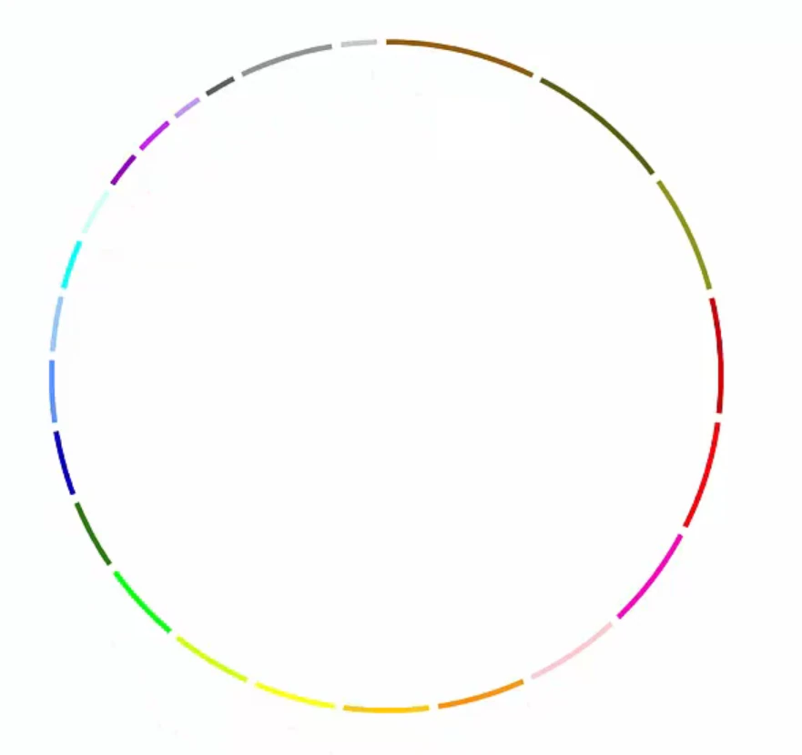
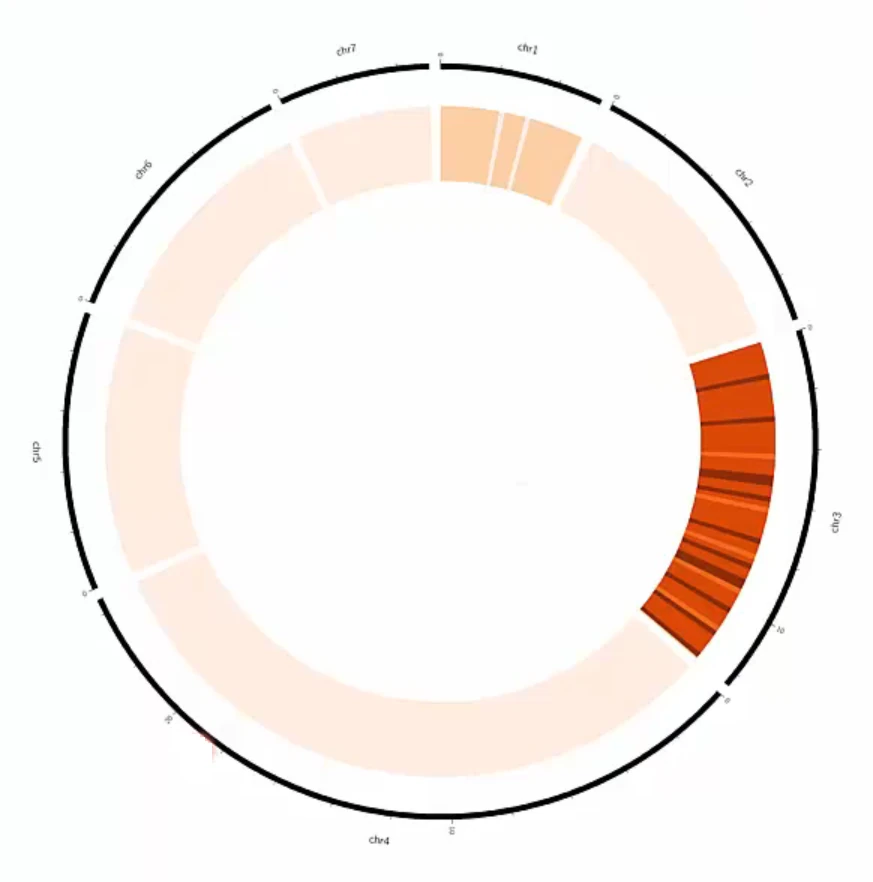
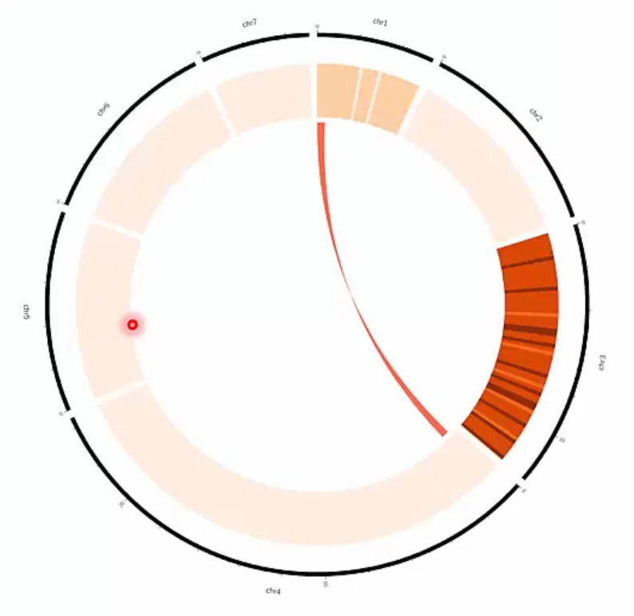

본 post는 국가생명연구자원정보센터(KOBIC) 주관 서울대학교 박사 후 연구원 김준님의 [Visualization](https://www.edwith.org/longread-seq-2023/lecture/1475115, "Visualization")를 정리한 내용입니다.

## Intro
***

* Visualization에 가장 널리 쓰이는 circos plot에 대해 알아봅니다.
  

## Circos Plot
***

[Circos Plot](http://circos.ca/, "Circos Plot")은 chromosome, alignment, SNP/SV density를 plotting하는데 유용한 tool입니다.
  

Human chromosome 별로 색상을 구분하여 그린 ideogram입니다.
  

_Human Ideogram 
https://www.edwith.org/longread-seq-2023/lecture/1475115_
  

Human chromosome 별로 gene density를 표현한 plot입니다.
  

_Gene Density 
https://www.edwith.org/longread-seq-2023/lecture/1475115_
  

위 plot에 alignment까지 추가한 plot입니다.
  

_Gene Density with alignments 
https://www.edwith.org/longread-seq-2023/lecture/1475115_
  

## Take Home Message
***

* Circos를 이용하여 plot을 그릴 수 있습니다.

* Gene density 외에도 SNP, SV, read depth 등을 포함할 수 있습니다.

* Alignment를 이용해 다양한 관계를 표현할 수 있습니다.
