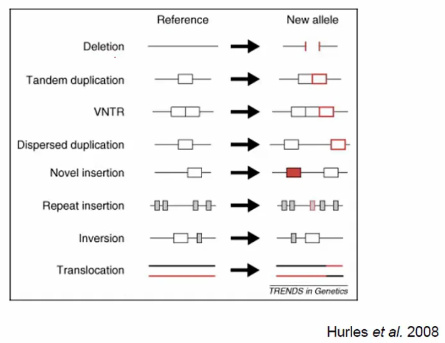
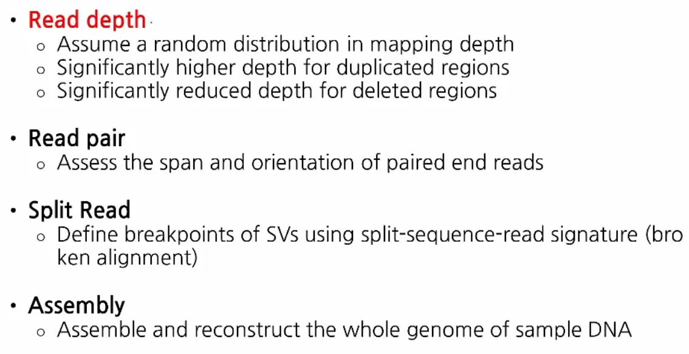
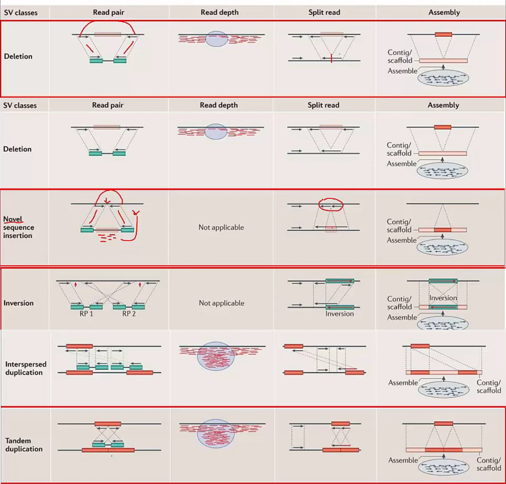

본 post는 국가생명연구자원정보센터(KOBIC) 주관 연세대학교 의과대학 김상우 교수님의 [NGS 데이터 분석 기초 강의](https://www.edwith.org/ngs-data-variation/joinLectures/356132, "NGS 데이터 분석 기초 강의")를 정리한 내용입니다.

## Intro
***

NGS를 이용한 structural variation 탐지 방법을 알아봅니다.
  

## Structural Variations
***

_List of Structural Variations 
https://www.edwith.org/ngs-data-variation/joinLectures/356132_
  

Structural variations 종류입니다. NGS를 사용하여 대부분 검출할 수 있습니다.
  

_Methods for SV Detection 
https://www.edwith.org/ngs-data-variation/joinLectures/356132_
  

SV 검출은 어려운 과정이므로 아래와 같이 여러 가지 방법(알고리즘)을 사용하여 결과를 도출하는 것이 좋습니다.
  

_Methods for SV Detection 
https://www.edwith.org/ngs-data-variation/joinLectures/356132_
  

## Take Home Message
***

NGS를 이용한 SV 검출은 read depth, split reads, assembly 등의 정보를 활용하여 가능함을 알 수 있었습니다.
