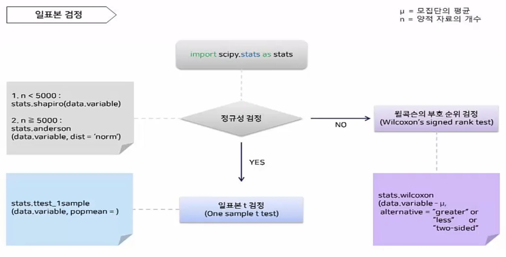
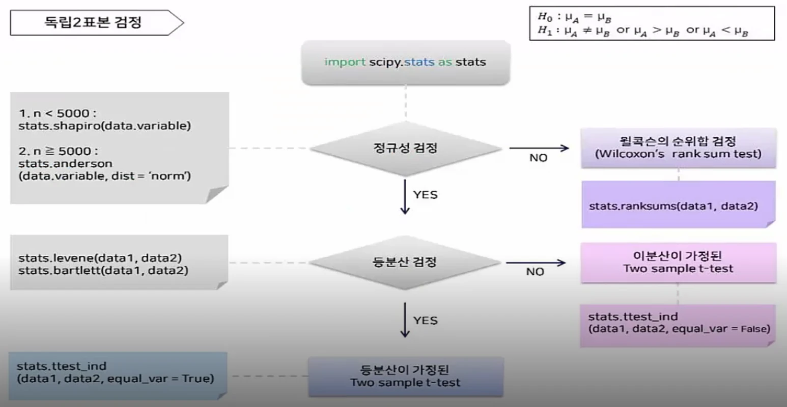
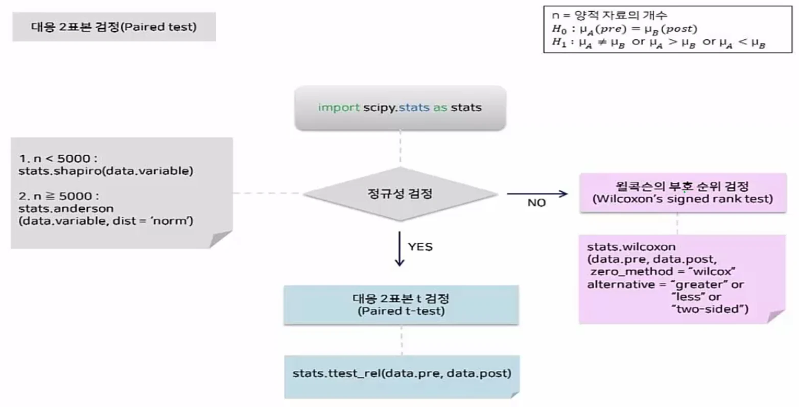
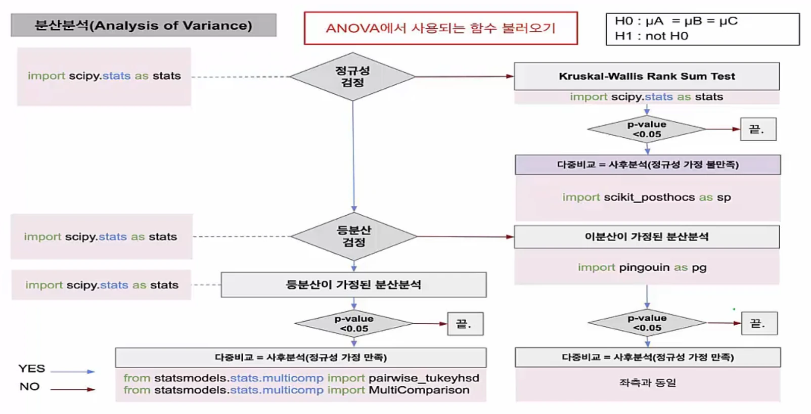

본 post는 국가생명연구자원정보센터(KOBIC) 주관 인사이트마이닝 이부일 CEO의 전체 강의를 정리한 내용입니다.

## 일표본 검정
***

_일표본 검정 
https://www.edwith.org/python-data-analysis-2023/lecture/1475052_
  

## 독립2표본 검정
***

_독립2표본 검정 
https://www.edwith.org/python-data-analysis-2023/lecture/1475052_
  

## 대응2표본 검정
***

_대응2표본 검정 
https://www.edwith.org/python-data-analysis-2023/lecture/1475052_
  

## ANOVA
***

_ANOVA 
https://www.edwith.org/python-data-analysis-2023/lecture/1475052_
  

## Take Home Message
***

Python을 활용하여 데이터에 알맞은 통계분석 방법을 학습했습니다.
  
